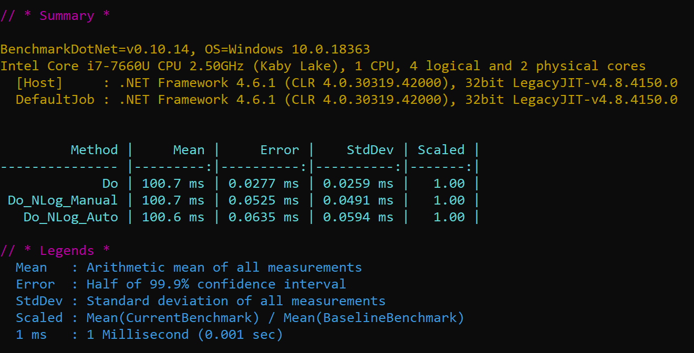
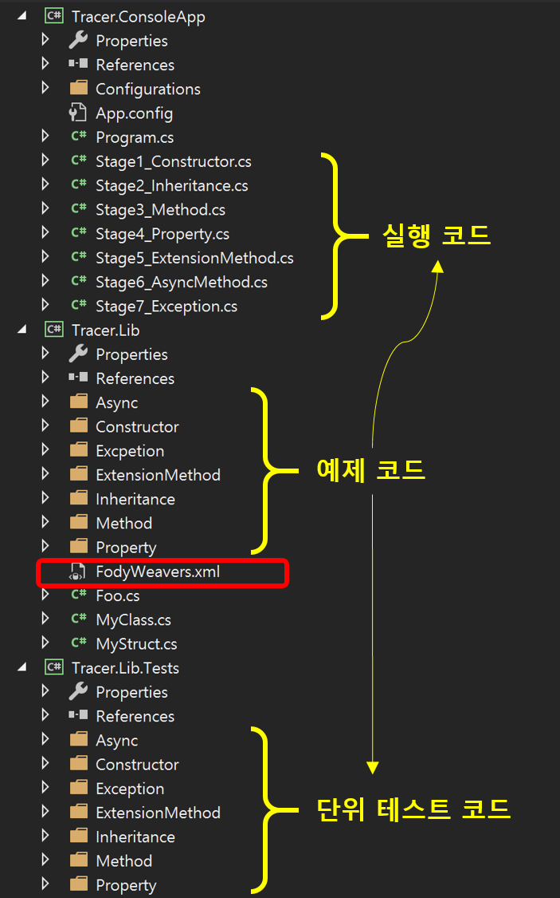
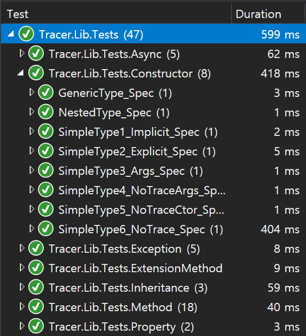

# 로그 출력 자동화

## 목차
1. **[목표](#1-목표)**
1. **[기대효과](#2-기대효과)**
1. **[기본 구성](#3-기본-구성)**
1. **[로그 출력 자동화](#4-로그-출력-자동화)**  
   4.1 **[추적](#41-추적)**  
   4.2 **[추적 제외](#42-추적-제외)**  
   4.3 **[추적 패턴](#43-추적-패턴)**  
1. **[로그 출력 자동화 원리](#5-로그-출력-자동화-원리)**
1. **[성능 테스트](#6-성능-테스트)**
1. **[에제 코드 구성](#7-에제-코드-구성)**
1. **[참고 자료](#8-참고-자료)**

<br/>

## 1. 목표
- **Trace Level 로그 출력 자동화**
  - **Trace: 메서드 실행을 추적하기 위한 메서드 시작과 종료를 출력한다.**
  - public 메서드가 추적 대상이다(protected, private 메서드 추적도 가능하다).
  - public 메서드의 입출력 타입과 값을 출력한다(Primitive Type만 값을 제공한다).
  - public 메서드 실행 시간(ms 단위)을 출력한다.
  - 적용 전 코드
    ```cs
    string value = sample.DoSomething(2019);

    public string DoSomething(int x)
    {
       _logger.Trace("Entered into DoSomething");  // 자동화 대상
       ...
       _logger.Trace("Returned from DoSomething"); // 자동화 대상
       return "2020";
    }
    ```
  - 적용 후 코드
    ```cs
    string value = sample.DoSomething(2019);

    public string DoSomething(int x)
    {
       ...
       return "2020";
    }
    ```
  - 적용 후 로그 출력
    - 메서드 이름과 입출력 타입과 값을 확인할 수 있다.
      - 입력: DoSomething(Int32) (x=2019)
      - 출력: DoSomething(Int32) ($return=2020)
    - 메서드 실행 시간을 확인할 수 있다.
      - 시간: 10.5 ms
    ```
    TRACE TracerApp Entered into DoSomething(Int32) (x=2019).
    TRACE TracerApp Returned from DoSomething(Int32) ($return=2020). Time taken: 10.5 ms.
    ```
- **Error Level 로그 출력 자동화**
  - **Error: 메서드 실행 중 예외를 출력한다.**
  - 적용 전 코드
    ```cs
    public void DoSomething()
    {
       try // 자동화 대상
       { 
          ...
       }
       catch (Exception ex)
       {
           _logger.Error(ex, "예외 발생 이유를 기술한다.");
           throw;   // 로직 구현에 따라 예외 전파를 결정한다.
       }
    }
    ```
  - 적용 후 코드
    ```cs
    public void DoSomething()
    {
       ...
    }
    ```
  - 적용 후 로그 출력
    - Tracer.4NLog.Fody 3.3.0 패키지는 예외 처리 로그를 Trace Level로 출력한다.
    - Tracer.4NLog.Fody 3.3.0 패키지는 예외 처리 로그를 출력 후에 rethrow한다.
    - 예외 타입과 소스 라인, 호출 스택을 확인할 수 있다.
    ```
    TRACE TracerApp Entered into DoSomething().
    TRACE TracerApp Returned from DoSomething() ($exception=System.ApplicationException: failed
            위치: TracerApp.Foo.DoSomething() 파일 C:\ ... \Foo.cs:줄 2020). Time taken: 10.5 ms.
    ```

## 2. 기대효과
- Trace 로그로 비즈니스 흐름(메서드 시작과 종료)을 파악할 수 있다.
- 메서드 실행 시간을 파악할 수 있다.

## 3. 기본 구성
- .NET Framework 4.6 또는 .NET Standard 2.0 이상
- Tracer.4NLog.Fody([GitHub](https://github.com/csnemes/tracer), [NuGet](https://www.nuget.org/packages/Tracer.4NLog.Fody/)) 최신 패키지 설치(2020년 4월 10일: 3.3.0)
  - 의존성 패키지: Fody 4.2.1(**Visual Studio 2017은 4.x 버전만 제공한다**)
  - 의존성 패키지: NLog 4.5.11
- FodyWeavers.xml 파일 환경 설정
  - traceConstructors: 생성자 추적 유/무
  - traceProperties: 속성 추적 유/무(예. public int X { get; set; })
  ```xml
  <?xml version="1.0" encoding="utf-8"?>
  <Weavers xmlns:xsi="http://www.w3.org/2001/XMLSchema-instance" xsi:noNamespaceSchemaLocation="FodyWeavers.xsd">
    <Tracer adapterAssembly="Tracer.NLog"
          logManager="Tracer.NLog.Adapters.LogManagerAdapter"
          logger="Tracer.NLog.Adapters.LoggerAdapter"
          staticLogger="Tracer.NLog.Log"
          traceConstructors="true"
          traceProperties="true">
    </Tracer>
  </Weavers>
  ```
- 추적 대상
  - public 메서드(생성자, 속성, 메서드)가 기본 추적 대상이다.
- 추적 제외 설정
  - 생성자와 속성은 FodyWeavers.xml 파일에서 전역으로 추적 제외 유/무를 설정한다.
    - 생성자: ```traceConstructors="true"```
    - 속성: ```traceProperties="true"```
  - ```[NoTrace]```: "클래스, 메서드, 메서드 입력 값"을 제외한다.
  - ```[NoReturnTrace]```: "메서드 출력 값"을 제외한다.

## 4. 로그 출력 자동화
### 4.1 추적
- 생성자
  - FodyWeavers.xml 파일: ```traceConstructors="true"```
  - 예
    ```cs
    Sample sample = new Sample();

    public class Simple
    {
    }
    ```
    ```
    TRACE TracerApp.Simple Entered into .ctor().
    TRACE TracerApp.Simple Returned from .ctor() (). Time taken: 0.16 ms.
    ```
- 속성
  - FodyWeavers.xml 파일: ```traceProperties="true"```
  - 예
    ```cs
    sample.X = 2020;

    public class Simple
    {
        public int X { get; set; }
    }
    ```
    ```
    TRACE TracerApp.Simple Entered into set_X(Int32) (value=2020).
    TRACE TracerApp.Simple Returned from set_X(Int32) (). Time taken: 0.01 ms.
    ```
- 메서드
  - 입출력 타입과 값을 제공한다(ToString() 결과 값이다).
  - 예
    ```cs
    sample.DoSomething("2019");
    
    public class Simple
    {
        public int DoSomething(string msg)
        {
            ...
            return 2020;
        }
    }
    ```
    ```
    TRACE TracerApp.Simple Entered into DoSomething(String) (msg=2019).
    TRACE TracerApp.Simple Returned from DoSomething(String) ($return=2020). Time taken: 0.27 ms.
    ```
    - 입력: string msg
      - 타입: String
      - 값: msg=2019
    - 출력: int
      - 타입: 제공하지 않는다.
      - 값: $return=2020

### 4.2 추적 제외
- 생성자
  - FodyWeavers.xml 파일: ```traceConstructors="false"```    
  - 예
    ```cs
    Sample sample = new Sample();

    public class Simple
    {
    }
    ```
    ```
    // 로그 출력이 없다. 
    ```
- 속성
  - FodyWeavers.xml 파일: ```traceProperties="false"```
  - 예
    ```cs
    sample.X = 2020;

    public class Simple
    {
        public int X { get; set; }
    }
    ```
    ```
    // 로그 출력이 없다. 
    ```
- 클래스: ```[NoTrace]```
  - 클래스에 있는 모든 public 메서드를 추적하지 않는다.
  - 예
    ```cs
    sample.DoSomething("2019");
    
    using TracerAttributes;

    [NoTrace]
    public class Simple
    {
        public int DoSomething(string msg)
        {
            ...
            return 2020;
        }
    }
    ```
    ```
    // 로그 출력이 없다. 
    ```
- 메서드: ```[NoTrace]```
  - 지정된 메서드만 추적하지 않는다.
  - 예
    ```cs
    sample.DoSomething("2019");
    
    public class Simple
    {
        [NoTrace]
        public int DoSomething(string msg) // Trace Level 로그를 출력하지 않는다.
        {
            ...
            return 2020;
        }

        public void DoSomethingMore()  // Trace Level 로그를 출력한다.
        {
            ...
        }
    }
    ```
    ```
    // 로그 출력이 없다. 
    ```
- 메서드 입력 값: ```[NoTrace]```
  - 지정된 메서드 입력 인자 값이 출력되지 않는다(ToString() 결과 값이다).
  - 예
    ```cs
    sample.DoSomething("2019");
    
    public class Simple
    {
        public int DoSomething([NoTrace] string msg)
        {
            ...
            return 2020;
        }
    }
    ```
    ```
    TRACE TracerApp.Simple Entered into DoSomething(String).
    TRACE TracerApp.Simple Returned from DoSomething(String) ($return=2020). Time taken: 0.03 ms.
    ```
- 메서드 출력 값: ```[NoReturnTrace]```
  - 메서드 출력 값이 출력되지 않는다.
  - 예
    ```cs
    sample.DoSomething("2019");
    
    public class Simple
    {
        [NoReturnTrace]
        public int DoSomething([NoTrace] string msg)
        {
            ...
            return 2020;
        }
    }
    ```
    ```
    TRACE TracerApp.Simple Entered into DoSomething(String).
    TRACE TracerApp.Simple Returned from DoSomething(String) (). Time taken: 0.03 ms.
    ```
### 4.3 추적 패턴
- 추적 대상 유/무를 ```FodyWeavers.xml``` 파일에서 전역으로 설정한다.
- 추적 대상 유/무
  - &lt;On&gt;: 추적 대상
  - &lt;Off&gt;: 추적 제외 대상
- 패턴 구성
  - ```namespace_part.class_part.member_part```
- ```namespace_part``` 패턴 
  - ..: 모든 하위 네임스페이스를 포함 시킨다.
  - 예: ```My*.Core..Package?```
    - MyNamespace.Core.Package1
    - MyNamespace.Core.Other.Package2
    - MyNamespace.Core.Other.Some.Package3
- ```class_part``` 패턴
  - ```[public|internal]class_name_filter```
- ```member_part``` 패턴
  - ```[public|private|protected|internal|get|set|method|constructor|instance|static]member_name_filter```
- 예: RootNamespace 네임스페이스에서 Repository 접미사(suffix) 클래스의 public GetBy 메서드를 추적한다. 단 GetByUserId 메서드는 제외한다.
  ```
  <?xml version="1.0" encoding="utf-8"?>
  <Weavers xmlns:xsi="http://www.w3.org/2001/XMLSchema-instance" xsi:noNamespaceSchemaLocation="FodyWeavers.xsd">
    <Tracer traceConstructors="true" traceProperties="false" filter="pattern">
      <On pattern="RootNamespace.*Repository.[public]GetBy*" />
      <Off pattern="RootNamespace.*Repository.GetByUserId" />
    </Tracer>
  </Weavers>
  ```
  ```cs
  MyRepository myRepository = new MyRepository();
  myRepository.GetBy("Foo");       // 추적 로그를 출력한다.
  myRepository.GetByUserId(2019);  // 추적 로그를 출력하지 않는다.

  namespace RootNamespace
  {
      public class MyRepository
      {
          // 추적 대상이다.
          public int GetBy(string name)
          {
              return 2020;
          }

          // 추적 제외 대상이다.
          public int GetByUserId(int id)
          {
              return 2020;
          }
      }
  }
  ```
  ```
  TRACE RootNamespace.MyRepository Entered into GetBy(String) (name=Foo).
  TRACE RootNamespace.MyRepository Returned from GetBy(String) ($return=2020). Time taken: 0.00 ms.
  ```

## 5. 로그 출력 자동화 원리
- IL코드를 컴파일 과정에 변경 시킨다.
- 예
  - 코드
    ```cs
    public class Simple
    {
        public int DoSomething(string msg)
        {
            return 2020;
        }
    }
    ```
  - 컴파일된 코드: ILSpy([GitHub](https://github.com/icsharpcode/ILSpy), [Extension](https://marketplace.visualstudio.com/items?itemName=SharpDevelopTeam.ILSpy))을 사용한다.
    - 로그 멤버 변수: ```private static LoggerAdapter $log```
    - 메서드 실행 시간: ```long timestamp = Stopwatch.GetTimestamp();```
    - 예외 처리: ```try```
    - 다시 throw: ```throw;```
    ```cs
    public class Simple
    {
        private static LoggerAdapter $log = LogManagerAdapter.GetLogger(typeof(Simple));
    
        public int DoSomething(string msg)
        {
            string[] array = new string[1];
            object[] array2 = new object[1];
            array[0] = "msg";
            array2[0] = msg;
            $log.TraceEnter("DoSomething(String)", null, array, array2);
            long timestamp = Stopwatch.GetTimestamp();
            int num;
            try
            {
                num = 2020;
            }
            catch (Exception ex)
            {
                array = new string[1];
                array2 = new object[1];
                array[0] = "$exception";
                array2[0] = ex;
                $log.TraceLeave("DoSomething(String)", null, timestamp, Stopwatch.GetTimestamp(), array, array2);
                throw;
            }
            array = new string[1];
            array2 = new object[1];
            array[0] = null;
            array2[0] = num;
            $log.TraceLeave("DoSomething(String)", null, timestamp, Stopwatch.GetTimestamp(), array, array2);
            return num;
        }
    }
    ```

## 6. 성능 테스트
- NLog 설정: Disk IO로 인한 성능 테스트 영향을 제거하기 위해 Memory Target으로 지정한다.
  ```
  <targets>
    <target xsi:type="Memory" name="c" layout="${pad:padding=5:inner=${level:uppercase=true}} ${logger} ${message}"/>
  </targets>
  ```
- 성능 테스트 코드
  ```cs
  using NLog;
  using System.Threading;
  using TracerAttributes;
  using BenchmarkDotNet.Attributes;
  using ILogger = NLog.ILogger;
  
  namespace Tracer.Performance
  {
      public class Foo
      {
          private static readonly ILogger _logger = LogManager.GetCurrentClassLogger();
  
          // 로그가 없는 기본 코드
          [NoTrace]
          [Benchmark(Baseline = true)]
          public void Do()
          {
              Thread.Sleep(100);
          }
  
          // 로그 출력 코드
          [NoTrace]
          [Benchmark]
          public void Do_NLog_Manual()
          {
              _logger.Trace("Entered into Do_NLog_Manual");
              Thread.Sleep(100);
              _logger.Trace("Returned from Do_NLog_Manual");
          }
  
          // 로그 출력 자동화 코드
          [Benchmark]
          public void Do_NLog_AutoN()
          {
              Thread.Sleep(100);
          }
      }
  }
  ```
- 컴파일된 성능 테스트 코드
  ```cs
  using NLog;
  using System.Threading;
  using TracerAttributes;
  using BenchmarkDotNet.Attributes;
  using ILogger = NLog.ILogger;
  
  namespace Tracer.Performance
  {
      public class Foo
      {
          private static readonly ILogger _logger = LogManager.GetCurrentClassLogger();
          private static LoggerAdapter $log = LogManagerAdapter.GetLogger(typeof(Foo));
  
          [NoTrace]
          [Benchmark(Baseline = true)]
          public void Do()
          {
              Thread.Sleep(100);
          }
  
          [NoTrace]
          [Benchmark]
          public void Do_NLog_Manual()
          {
              _logger.Trace("Entered into Do_NLog_Manual");
              Thread.Sleep(100);
              _logger.Trace("Returned from Do_NLog_Manual");
          }
  
          [Benchmark]
          public void Do_NLog_AutoN()
          {
              $log.TraceEnter("Do_NLog_AutoN()", null, null, null);
              long timestamp = Stopwatch.GetTimestamp();
              try
              {
                  Thread.Sleep(100);
              }
              catch (Exception ex)
              {
                  string[] array = new string[1];
                  object[] array2 = new object[1];
                  array[0] = "$exception";
                  array2[0] = ex;
                  $log.TraceLeave("Do_NLog_AutoN()", null, timestamp, Stopwatch.GetTimestamp(), array, array2);
                  throw;
              }
              $log.TraceLeave("Do_NLog_AutoN()", null, timestamp, Stopwatch.GetTimestamp(), null, null);
          }
      }
  }
  ```
- 성능 테스트 결과  
  - 로그 출력 자동화는 성능에 큰 영향을 미치지 않는다.  
      

## 7. 에제 코드 구성
- 프로젝트 구성
  - Tracer.ConsoleApp: 예제 콘솔 App
  - Tracer.Lib: 로그 추적 예제
  - Tracer.Lib.Tests: 단위 테스트
  - Tracer.Performance: 성능 테스트 콘솔 App
  - Tracer.PatternApp: 패턴 예제 콘솔 App
- 코드 구성  
    
- 단위 테스트  
    

## 8. 참고 자료
- [외부 자료 - Tracer.4NLog.Fody](https://github.com/csnemes/tracer/wiki/Basics)
- [외부 자료 - 스택 정보를 유지하도록 다시 throw 하기](https://docs.microsoft.com/ko-kr/visualstudio/code-quality/ca2200?view=vs-2019)
