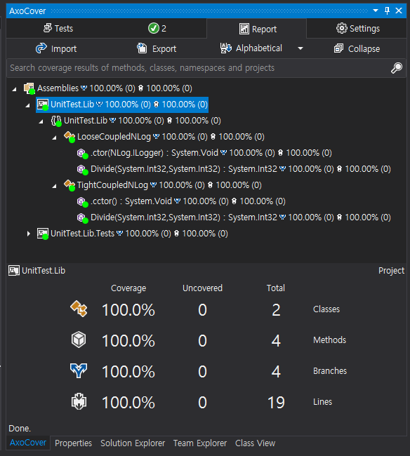

# 로그 단위 테스트

## 목차
1. **[환경](#1-환경)**
1. **[NLog 의존성](#2-nlog-의존성)**
1. **[코드 커버리지 제외](#3-코드-커버리지-제외)**
1. **[NLog 단위 테스트](#4-nlog-단위-테스트)**
1. **[코드 커버리지](#5-코드-커버리지)**

<br/>

## 1. 환경
1. UnitTest.ConsoleApp: 콘솔 프로젝트
   - .NET Framework 4.5
   - Autofac 4.9.4(5.x 버전은 .NET Framework 4.5을 지원하지 않는다.)
   - NLog 4.7.0
1. UnitTest.Lib: 단위 테스트 대상 프로젝트
   - .NET Framework 4.5
   - NLog 4.7.0
1. UnitTest.Lib.Tests: 단위 테스트 프로젝트
   - .NET Framework 4.5.2(4.5.2 이상부터만 xUnit 2.2.0가 정상 동작한다)
   - NLog 4.7.0
   - FluentAssertions 5.10.3
   - xUnit, xUnit.Runner.VisualStudio 2.2.0(AxoCover 1.1.7.0은 xUnit 2.2.0만 지원한다)

## 2. NLog 의존성
1. 강한 결합(Tight Coupled)
   - ```private static readonly ILogger _logger = LogManager.GetCurrentClassLogger();``` 정적 메서드로 Logger 인스턴스를 얻는다.
   - 강한 결합일 때도 단위 테스트가 가능하다.
   - 예
     ```cs
     public class TightCoupledNLog
     {
         private static readonly ILogger _logger = LogManager.GetCurrentClassLogger();
     
         public int Divide(int x, int y)
         {
             _logger.Trace("Entered into Divide");
             ...
         }
     }
     ```
1. 약한 결합(Loose Coupled)
   - Logger 인스턴스를 생성자로 주입 받는다.
   - 의존성을 외부에 노출하면 단위 테스트 객체를 외부에서 주입(DI: Dependency Injection) 받을 수 있다.
   - 예
     ```cs
     public class LooseCoupledNLog
     {
         private readonly ILogger _logger;
   
       
         public LooseCoupledNLog(ILogger logger)
         {
             _logger = logger;
         }
   
         public int Divide(int x, int y)
         {
             _logger.Trace("Entered into Divide");
             //  ...
         }
     }
     ```

## 3. 코드 커버리지 제외
1. ```ExcludeFromCodeCoverage``` 애트리뷰트
   - 제외 대상 클래스, 생성자, 메서드는 ExcludeFromCodeCoverage 애트리뷰트를 지정한다.
   - 예: 특정 메서드 제외하기
     ```cs
     using System.Diagnostics.CodeAnalysis;

     [ExcludeFromCodeCoverage]
     public void DoSomething()
     { 
         ...
     }
     ```
   - 예: 클래스 전체 제외하기
     ```cs
     using System.Diagnostics.CodeAnalysis;

     [ExcludeFromCodeCoverage]
     public class Foo
     {
         ...
     }
      ```

## 4. NLog 단위 테스트
1. MemoryTarget
   - MemoryTarget은 NLog에서 제공하는 메모리 출력 Target이다.
   - MemoryTarget을 이용하여 테스트 로그를 모두 메모리에 수집한다.
   - MemoryTarget 정보
     - 위키: https://github.com/NLog/NLog/wiki/Memory-target
     - 단위 테스트: https://github.com/NLog/NLog/blob/dev/tests/NLog.UnitTests/Targets/MemoryTargetTests.cs
   - 예
     ```cs
     public class TightCoupledNLogSpec
     {
         private readonly MemoryTarget _memoryTarget;
     
         public TightCoupledNLogSpec()
         {
             _memoryTarget = new MemoryTarget
             {
                 Layout = "${level}"
             };
     
             // Trace 수준부터 모든 로그를 수집한다.
             SimpleConfigurator.ConfigureForTargetLogging(_memoryTarget, LogLevel.Trace);
         }

         ...
     }
     ```
1. SimpleConfigurator 환경 설정
   - SimpleConfigurator은 NLog에서 제공하는 기본 환경 설정을 제공하는 정적 클래스다.
   - 예
     ```cs
     // Target과 Level만 지정한다.
     SimpleConfigurator.ConfigureForTargetLogging(_memoryTarget, LogLevel.Trace);
     ```
1. 직렬화
    - xUnit 단위 테스트 병렬화를 Disable 시킴
    - 예
      ```cs
      // AssemblyInfo.cs 파일
      [assembly: Xunit.CollectionBehavior(DisableTestParallelization = true)]
      ```
1. 강한 결합(Tight Coupled) 단위 테스트
   - ```private static readonly ILogger _logger = LogManager.GetCurrentClassLogger();```
   - LogManager의 GetCurrentClassLogger 메서드는 SimpleConfigurator의 환경 설정으로 동작한다.
   - MemoryTarget에 수집된 모든 결과는 ```public IList<string> Logs { get; }```에서 확인할 수 있다.
   - 예
     ```cs
     [Fact]
     public void ShouldHave_TwoTraces()
     {
         // Arrange
         TightCoupledNLog sut = new TightCoupledNLog();
     
         // Act
         sut.Divide(2019, 10);
     
         // Assert
         _memoryTarget.Logs
             .Where(log => log.StartsWith("Trace"))
             .Count()
             .Should().Be(2);
     }
     ```
1. 약한 결합(Loose Coupled) 단위 테스트
   - ```public LooseCoupledNLog(ILogger logger)```
   - 강한 결합 테스트와 기본 동작 원리는 모두 동일하다.
   - ```LogManager.GetCurrentClassLogger()```으로 생성자에 Logger 인스턴스을 추가적으로 주입한다.
   - 예
     ```cs
     [Fact]
     public void ShouldHave_TwoTraces()
     {
         // Arrange
         LooseCoupledNLog sut = new LooseCoupledNLog(LogManager.GetCurrentClassLogger());
     
         // Act
         sut.Divide(2019, 10);
     
         // Assert
         _memoryTarget.Logs
             .Where(log => log.StartsWith("Trace"))
             .Count()
             .Should().Be(2);
     }
     ```

## 5. 코드 커버리지
1. AxoCover
   - xUnit 2.2.0만 제공한다.
   - GitHub: https://github.com/axodox/AxoCover
   - VS Marketplace: https://marketplace.visualstudio.com/items?itemName=axodox1.AxoCover
   - Visual Studio 2019는 현재 제공하지 않는다(2020-04-07 기준)
     - [Warning on Open with VS2019 Plugin](https://github.com/axodox/AxoCover/issues/204)
     - [AxoCover for VS2019](https://github.com/axodox/AxoCover/issues/197)
1. PrestoCoverage
   - Visual Studio 2017, 2019 모두 제공한다.
   - Coverlet 기반으로 동작한다.
1. AxoCover 결과  
   