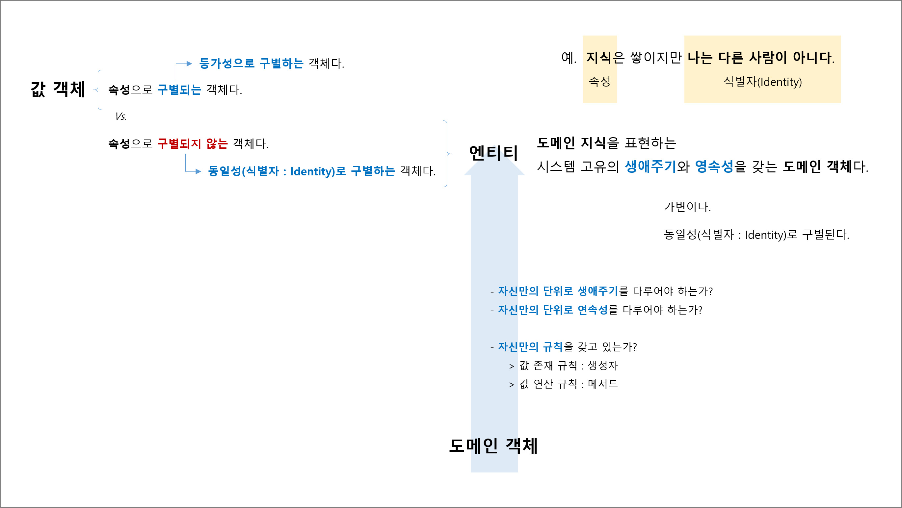

## 3장. 생애주기를 갖는 객체 '앤티티'

## 요약

## 엔티티 정의
- 도메인 지식을 표현하는 시스템 고유의 `생애주기`와 `영속성`을 갖는 도메인 객체다.
  - `생애주기`를 갖고 있는가?
  - `영속성`을 갖고 있는가?
  - `규칙`이 존재하는가?
    - 존재 규칙 : 생성자
    - 연산 규칙 : 메서드

## 엔티티 특징
1. 가변 : 생애주기를 갖고 태어나서 죽을 때까지 변화를 겪는다.
1. 동일성 : 식별자(Identity)로 구별된다.