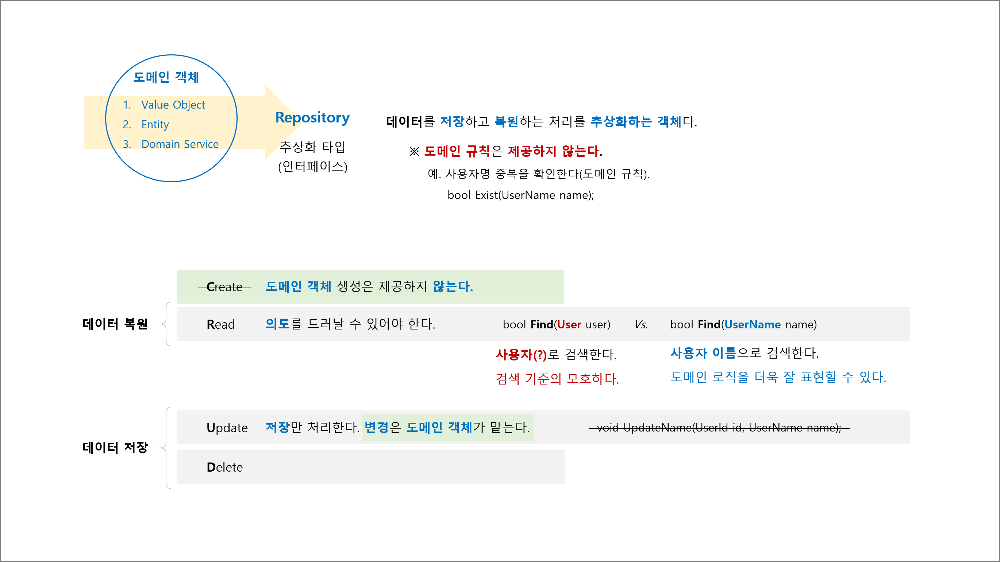

## 5장. 데이터와 관계된 처리를 분리하자 '리포지토리'

## 요약

## 리포지토리 정의
- 데이터를 `저장`하고 `복원`하는 처리를 추상화하는 객체다.  
  ※ 도메인 규칙은 제공하지 않는다.

## 리포지토리 특징
1. Create : 도메인 객체 생성은 제공하지 않는다.
1. Read : 의도를 드러날 수 있어야 한다.
   - 불명확 검색 의도 : `bool Find(User user)` 사용자의 어떤 기준으로 검색하는지 알수 없다.
   - 명확한 검색 의도 : `bool Find(UserName name)` 사용자 이름으로 검색한다.
1. Update : 저장만 제공한다. 변경은 도메인 객체가 담당한다.
1. Delete

## 리포지토리 도입 효과
1. 도메인 객체에서 데이터 저장과 복원을 분리하였다(직접 관여하지 않는다).
