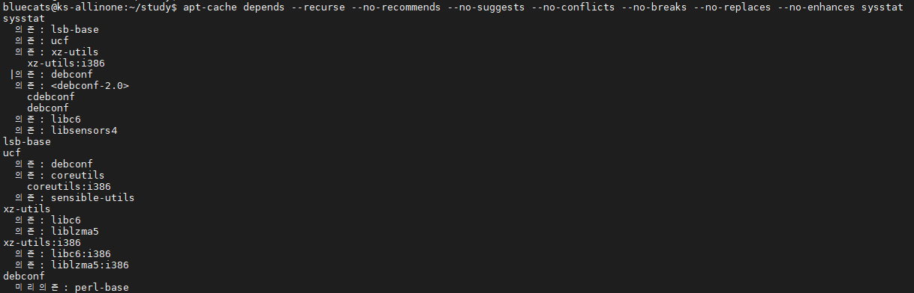
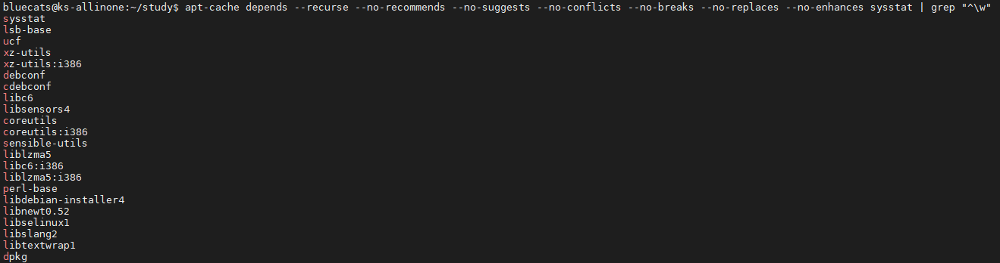
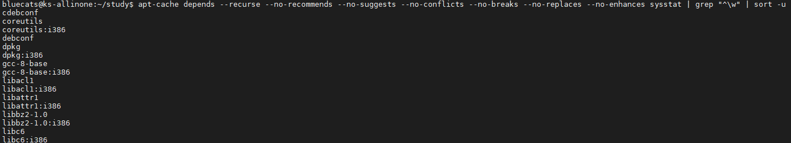

### Offline 설치를 위한 Ubuntu 패캐지 다운로드
1. 패키지 의존성 명령어
   ```bash
   apt-cache depends --recurse --no-recommends --no-suggests --no-conflicts --no-breaks --no-replaces --no-enhances [패키지명] | grep "^\w" | sort -u
   ```
   - `apt-get download` : 패키지를 다운로드 한다.
   - `apt-cache depends` : 패키지 의존성 정보를 출력한다.
   - `grep "^\w"` : 문자로 시작하는 줄만 출력한다.
   -  `sort -u` : 정렬 후 중복을 제거한다.
1. 패키지 의존성 명령어 구성 이해 : `apt-cache depends`, `grep`, `sort`
   - `apt-cache depends --recurse ...(옵션) sysstat` : 의존성 정보를 출력한다.  
        
   - `apt-cache depends --recurse ...(옵션) sysstat | grep "^\w"` : 문자로 시작하는 의존성 정보만 출력한다.  
        
   - `apt-cache depends --recurse ...(옵션) sysstat | grep "^\w" | sort -u` : 문자로 시작하는 의존성 정보를 정렬한 후 중복을 제거한다.  
        
1. 패키지 다운로드 명령어 
   ```bash
   apt-get download $(apt-cache depends --recurse --no-recommends --no-suggests --no-conflicts --no-breaks --no-replaces --no-enhances [패키지명] | grep "^\w" | sort -u)
   ```
1. 패키지 다운로드 명령어 예제 : vim
   ```
   // 패키지 다운로드
   apt-get download $(apt-cache depends --recurse --no-recommends --no-suggests --no-conflicts --no-breaks --no-replaces --no-enhances vim | grep "^\w" | sort -u)
   
   // 패키지 설치
   sudo dpkg -i *
   ```
1. 참고 사이트	 
   - [Download Recursive Dependencies Of A Package In Ubuntu](https://ostechnix.com/download-recursive-dependencies-of-a-package-in-ubuntu/)
