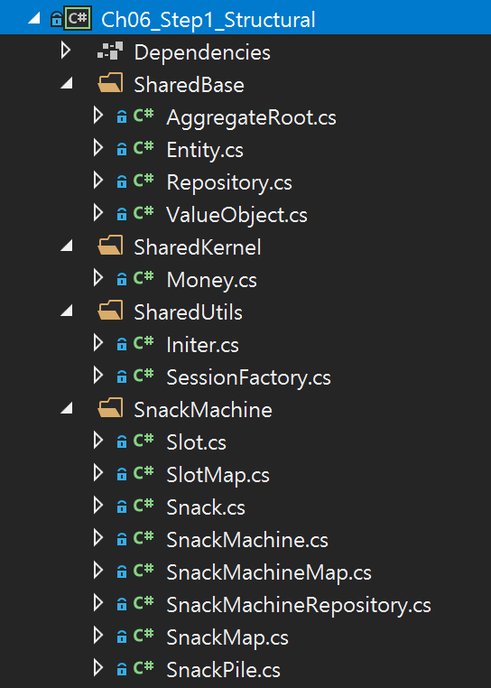

## 6장. Bounded Context

## 목차
1. 요약
1. 목표
1. 개발

 

## 1. 요약

 

## 2. 목표
1. ...

 

## 3. 개발

### Step 1. Structural Solution Explorer
1. 솔루션 탐색기 리팩토링
   - 리팩토링 전  
     
   - 리팩토링 후
     - **`Shared Kernel`** : 재사용 도메인 객체(예. Entity, Value Object, ...)
     - `Shared Base` : 재사용 부모 클래스
     - `Shared Utils` : 재사용 기능 클래스  
     

