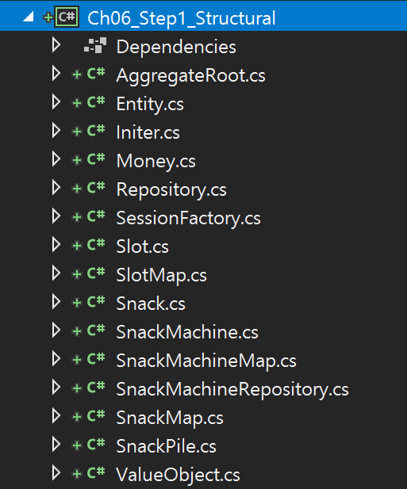
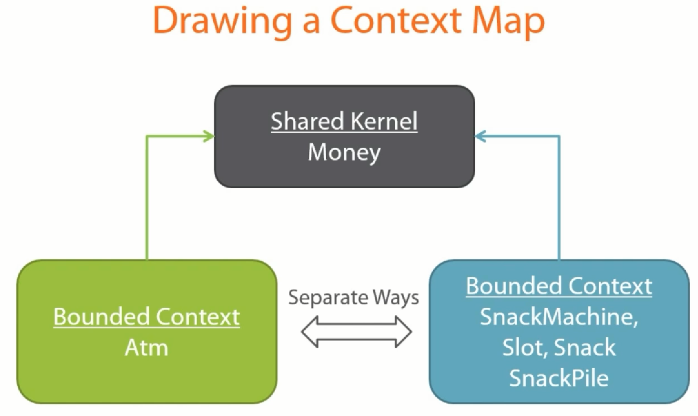

## 6장. Bounded Context

## 목차
1. 요약
1. 목표
1. 개발

 

## 1. 요약

 

## 2. 목표
1. ...

 

## 3. Bounded Context
- Bounded Contexts : **`Separation of the model into smaller ones`**
  - Boundary for the ubiquitous language : 한정된 맥락에서만 일관되게 통일된 용어를 사용한다.
  - Span across all layers in the onion architecture : 모든 계층에 걸쳐 있다(가로 지르다).
    - 동일한 개념의 아키텍처가 Bounded Contexts 개수와 동일하게 N개 존재하게 된다.
  - Explicit relationships between different bounded contexts : 관계를 명시적(Context Mapping)으로 정의한다.

## 3. 개발

### Step 1. Structural Solution Explorer
1. 솔루션 탐색기 리팩토링
   - 리팩토링 전  
     
   - 리팩토링 후
     - **`Shared Kernel`** : 재사용 도메인 객체(예. Entity, Value Object, ...)
     - `Shared Base` : 재사용 부모 클래스
     - `Shared Utils` : 재사용 기능 클래스  
     

### Step 2. ATM(Bounded Context)
1. Context Map
   
1. 요구사항
   - ATM | 요청한 현금을 제공한다.
     - Dispense cash
   - ATM | 수수료 1%을 부과한다.
     - Charge the user's bank card
   - ATM | 청구된 모든 금액을 추적한다.
     - Keep track of all money charged
1. 단위 테스트
   - ...
