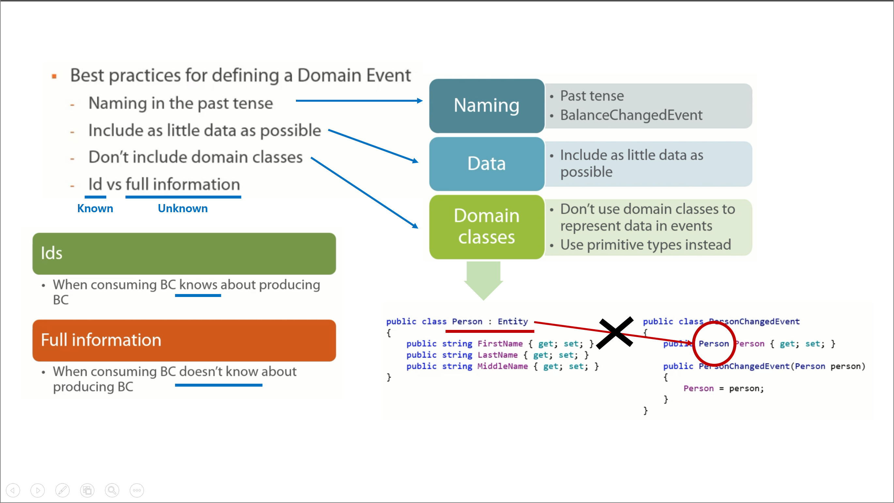

## 7장. Domain Event

## 목차
1. 요약
1. 목표
1. 개발

 

## 1. 요약

 

## 2. 목표
1. ...
도메인 이벤트 핸들러 = 도메인 서비스
Aggregate Root 책임
- 불변성
- 일관성 경계 유지

요구사항
- SnackMachine에서 Atm에 현금을 이동 시킨다.
## 3. 개발

### Step 1. 
1. ...

