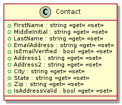
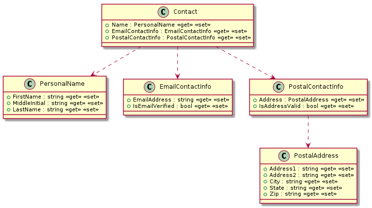

# Introduction
- Making design more transparent and improving correctness
- Creating "atomic" types

## 목차
- [Step 1. Introduction](#step1-introduction)

## Step1 Contact 클래스
- Atomic 데이터 타입을 만들자.

### Stage 1: 리팩토링 전  
- 상황: Contact 클래스는 **이름**과 **메일**, **주소**로 구성되어 있다.
- 코드
    ```cs
    public class Contact
    {
        // 이름
        public string FirstName { get; set; }
        // use "option" to signal optionality
        public string MiddleInitial { get; set; }
        public string LastName { get; set; }
          
        // 메일
        public string EmailAddress { get; set; }
        //true if ownership of email address is confirmed
        public bool IsEmailVerified { get; set; }

        // 주소          
        public string Address1 { get; set; }
        public string Address2 { get; set; }
        public string City { get; set; }
        public string State { get; set; }
        public string Zip { get; set; }
        //true if validated against address service
        public bool IsAddressValid { get; set; }
    }	
    ```
- 문제점: Contact 클래스는 SRP(Single Responsibility Principle) 원칙을 준수하지 않는다.
  > 데이터 사용 패턴(데이터 접근과 변경: 트랜잭션)을 통해 확인해 보자.
  - Zip이 변경될 때 Address1는 함께 변경될 것이다.
  - 그러나, EmailAddress가 변경될 때 FirstName 이름이 반드시 변경될까? 아니다.
  - IsEmailVerified는 메일이 변경될 때, IsAddressValid는 주소가 변경될 때 유효성 확인을 위해 함께 변경되어야 한다.
- UML 다이어그램  
    
  
### Stage 2: 리팩토링 후
- 개선점: 
  - **Guideline: Use records or tuples to group together data that are required to be consistent (that is “atomic”) but don’t needlessly group together data that is not related.**
  - 도메인을 표현하는 최소 단위 **이름**과 **메일**, **주소**로 세부 데이터 타입을 만든다.
  - 도메인 최소 단위 기준으로 타입을 분리시켜 불필요한 의존성을 제거한다.
- 코드
  ```cs
  public class Contact
  {
      // 이름
      public PersonalName Name { get; set; }
      
      // 메일
      public EmailContactInfo EmailContactInfo { get; set; }
      
      // 주소
      public PostalContactInfo PostalContactInfo { get; set; }
  }  
  ```  
- 리팩토링 후  
    

                                                                                               
