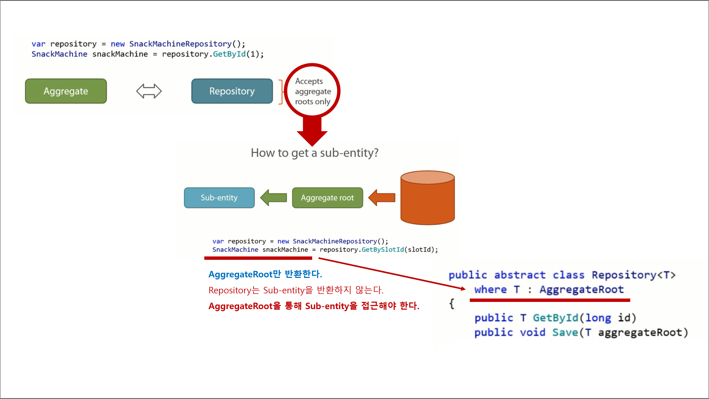
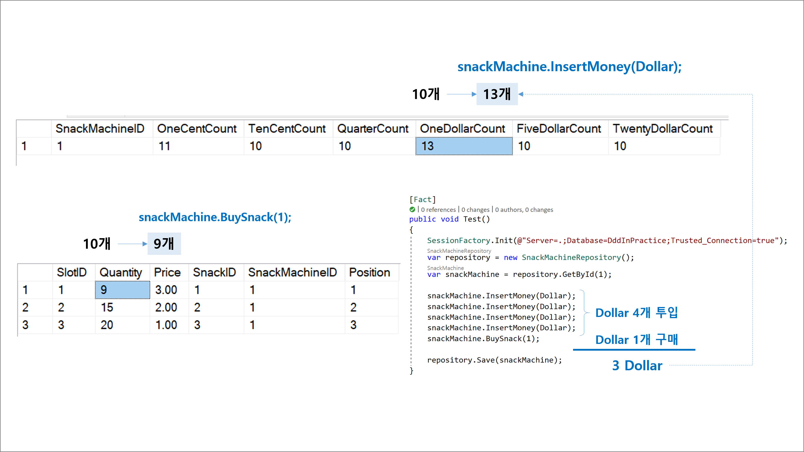
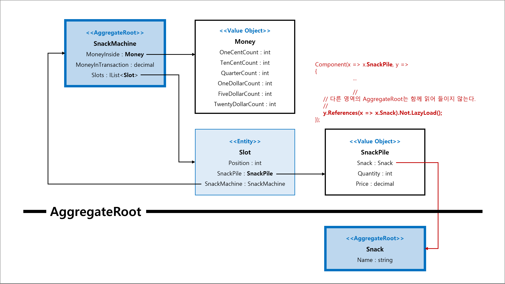

## 5장. Repository

## 목차
1. 요약
1. 목표
1. 개발

 

## 1. 요약

 

## 2. 목표
1. ...

 

## 3. 개발

### Step 1. Repository Pattern
1. 레파지토리
   - 데이터베이스와의 모든 통신을 캡슐화하기 위한 패턴이다.
   - `Application Service` ↔ `Repository` ↔ `Database` 