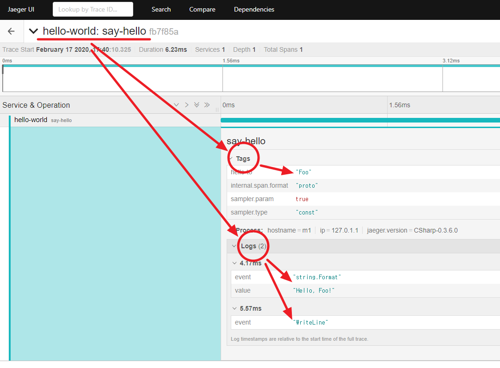

# OpenTracing & Jaeger

## Jaeger 설치하기

1. All in One 설치
   - 도커로 "All in One"을 설치한다.
   - <https://www.jaegertracing.io/docs/1.16/getting-started/>
      ```shell
        docker run -d --name jaeger \
            -e COLLECTOR_ZIPKIN_HTTP_PORT=9411 \
            -p 5775:5775/udp \
            -p 6831:6831/udp \
            -p 6832:6832/udp \
            -p 5778:5778 \
            -p 16686:16686 \
            -p 14268:14268 \
            -p 14250:14250 \
            -p 9411:9411 \
            jaegertracing/all-in-one:1.16
        ```
   - 사이트 접속하기: <http://localhost:16686>
   - 포트 정보
        | Port  | Protocol | Component | Function  |
        |---|---|---|------------|
        | 5775  | UDP      | agent     | accept zipkin.thrift over compact thrift protocol (deprecated, used by legacy clients only) |
        | **6831**  | **UDP**      | **agent**     | **accept jaeger.thrift over compact thrift protocol** |
        | 6832  | UDP      | agent     | accept jaeger.thrift over binary thrift protocol |
        | 5778  | HTTP     | agent     | serve configs |
        | 16686 | HTTP     | query     | serve frontend |
        | 14268 | HTTP     | collector | accept jaeger.thrift directly from clients |
        | 14250 | HTTP     | collector | accept model.proto |
        | 9411  | HTTP     | collector | Zipkin compatible endpoint (optional) |
1. 소스 빌드하기  
   - Jaeger 서버 IP와 Port을 지정한다.
     ```cs
     var reporterConfiguration = new Configuration.ReporterConfiguration(loggerFactory)
        .WithSender(new Configuration.SenderConfiguration(loggerFactory)
            //.WithAgentHost("192.168.99.201")
            .WithAgentHost("localhost")
            .WithAgentPort(6831))
        .WithLogSpans(true);
     ```
   - 빌드 및 실행하기
     - dotnet build
     - dotnet run Foo  
         
1. Jaeger 결과 확인하기  
   - ServiceName과 Trace을 확인한다.
     - ServiceName: hello-world
     - Span: say-hello  
         
   - Span에 출력된 Tags, Logs을 확인한다.  
     - Tag: hello-to, Foo
     - Log
       - string.Format, Hello, Foo!
       - WriteLine
     - 소스       
       ```cs
        public void SayHello(string helloTo)
        {
            var span = _tracer.BuildSpan("say-hello").Start();
            span.SetTag("hello-to", helloTo);
            var helloString = $"Hello, {helloTo}!";
            span.Log(new Dictionary<string, object>
                {
                    [LogFields.Event] = "string.Format",
                    ["value"] = helloString
                }
            );
            _logger.LogInformation(helloString);
            span.Log("WriteLine");
            span.Finish();
        }
       ```  
       
