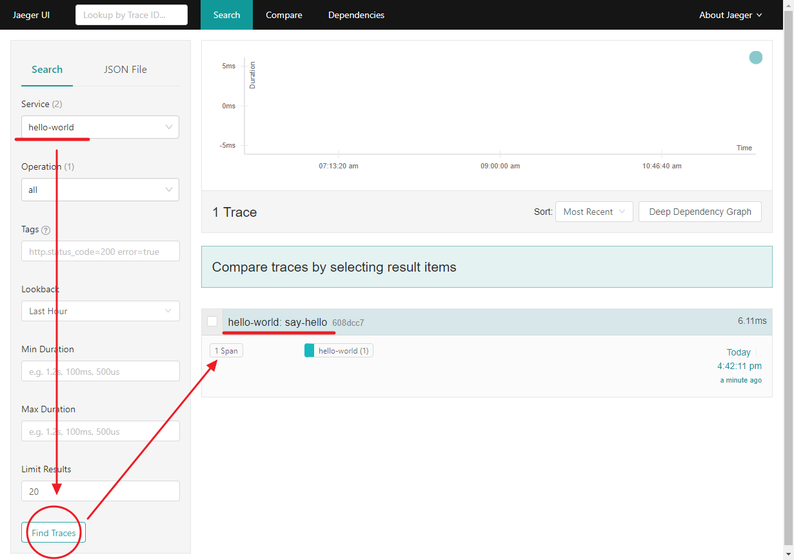

# Lesson 1 - **Step 3**

## 목표
- Trace 메시지(Jaeger)을 출력한다.

## 배움
- dotnet 프로젝트 참조 명령어
  - dotnet add reference
  - dotnet remove reference
- Jaeger 추적 메시지 출력
  - [ITracer](https://github.com/opentracing/opentracing-csharp/blob/c534179959d4a4160e06456cc70e609f827952e8/src/OpenTracing/ITracer.cs)
  - [ISpan](https://github.com/opentracing/opentracing-csharp/blob/d00349731545c04c989ba138f12e402cbe902208/src/OpenTracing/ISpan.cs)

## 따라하기
1. .NET Core 프로젝트 만들기
   ```shell
    // 프로젝트 만들기
    C:\DistributedTracing\Tutorial> dotnet new console -o .\Lesson1\Step3
    C:\DistributedTracing\Tutorial> dotnet sln add .\Lesson1\Step3\

    // 패키지 & 프로젝트 참조하기
    C:\DistributedTracing\Tutorial> dotnet add .\Lesson1\Step3\ package Microsoft.Extensions.Logging.Console
    C:\DistributedTracing\Tutorial> dotnet add .\Lesson1\Step3\ package Jaeger
    C:\DistributedTracing\Tutorial> dotnet add .\Lesson1\Step3\ package OpenTracing
    C:\DistributedTracing\Tutorial> dotnet add .\Lesson1\Step3\ reference .\LessonLib\

    // 192.168.99.201:6831
    C:\DistributedTracing\Tutorial> dotnet run --project .\Lesson1\Step3\ Foo
    info: Jaeger.Configuration[0]
            Initialized Tracer(ServiceName=hello-world, Version=CSharp-0.3.6.0, Reporter=CompositeReporter(Reporters=RemoteReporter(Sender=UdpSender(UdpTransport=ThriftUdpClientTransport(Client=192.168.99.201:6831))), LoggingReporter(Logger=Microsoft.Extensions.Logging.Logger`1[Jaeger.Reporters.LoggingReporter])), Sampler=ConstSampler(True), IPv4=-1062721647, Tags=[jaeger.version, CSharp-0.3.6.0], [hostname, DESKTOP-SK0NU4O], [ip, 192.168.39.145], ZipkinSharedRpcSpan=False, ExpandExceptionLogs=False, UseTraceId128Bit=False)
    info: Step3.Hello[0]
            Hello, Foo!
    info: Jaeger.Reporters.LoggingReporter[0]
            Span reported: 608dcc7bb95d7045:608dcc7bb95d7045:0:1 - say-hello
   ```
1. .NET Core 프로젝트 실행 결과
   - hello-world 서비스와 say-hello 스팬을 확인한다.
     
   - say-hello 스팬에 출력된 Tags와 Logs을 확인한다.
     
1. Tracing하기
   - Tracer 만들기
     ```cs
        public static Tracer Init(string serviceName, ILoggerFactory loggerFactory)  
        {
            // 샘플링 환경 설정하기
            var samplerConfiguration = new Configuration.SamplerConfiguration(loggerFactory)
                .WithType(ConstSampler.Type)
                .WithParam(1);

            // Tracer 서버 환경 설정하기
            // - m1 가상머신 IP: 192.168.99.201
            // - Port: 6831
            var reporterConfiguration = new Configuration.ReporterConfiguration(loggerFactory)
                .WithSender(new Configuration.SenderConfiguration(loggerFactory)
                    .WithAgentHost("192.168.99.201")
                    .WithAgentPort(6831))
                .WithLogSpans(true);

            // Tracer 만들기
            return (Tracer)new Configuration(serviceName, loggerFactory)
                .WithSampler(samplerConfiguration)
                .WithReporter(reporterConfiguration)
                .GetTracer();
        }
     ```
1. Span 만들기
   - Span 라이프사이클
     - 생성: BuildSpan
     - 시작: Start
     - 중지: Finish 또는 IDispose
     ```cs
        ISpan span = _tracer.BuildSpan("say-hello").Start();
        span.Finish();
        //span.Dispose();
     ```
   - Span Tag와 Log 출력하기
     ```cs
        // Span - Tag
        span.SetTag("hello-to", helloTo);

        // Span - Log 사용자 정의
        span.Log(new Dictionary<string, object>
            {
                [LogFields.Event] = "string.Format",
                ["value"] = msg
            }
        );

        // Span - Log
        span.Log("WriteLine");
     ```
1. Jaeger 설치하기
   - 설치하기
     ```shell
        docker run -d --name jaeger \
          -e COLLECTOR_ZIPKIN_HTTP_PORT=9411 \
          -p 5775:5775/udp \
          -p 6831:6831/udp \
          -p 6832:6832/udp \
          -p 5778:5778 \
          -p 16686:16686 \
          -p 14268:14268 \
          -p 14250:14250 \
          -p 9411:9411 \
          jaegertracing/all-in-one:1.16
     ```
   - 사이트 접속하기
     - http://192.168.99.201:16686/ 
	 - http://localhost:16686