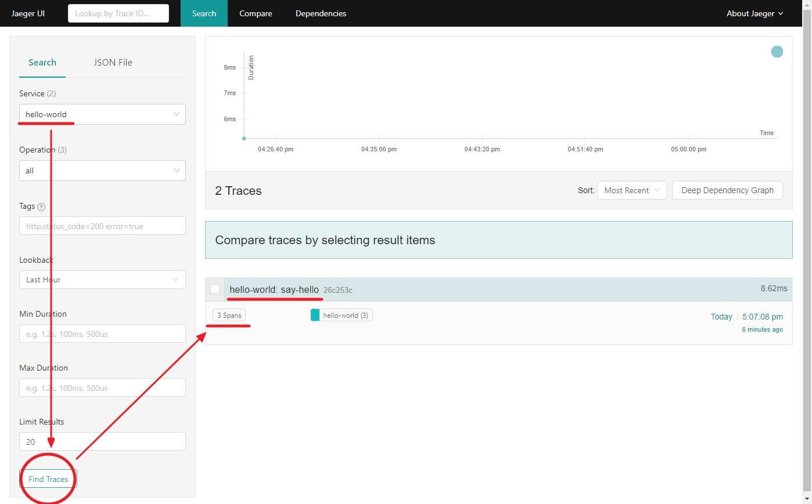
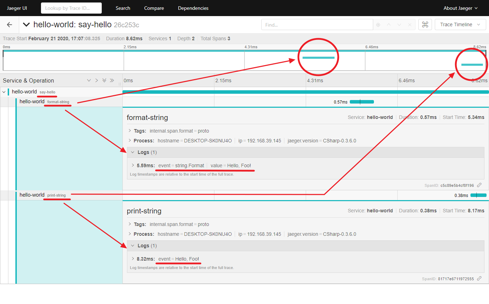

# Lesson 2 - **Step 1**

## 목표

- 자식 Span을 명시적으로 만든다.

## 배움

- 자식 Span 라이프사이클
  - [Tracer].BuildSpan([자식 Span 이름]).AsChildOf([부모 Span]).Start();
  - [Span].Finish() 또는 [Span].Dispose()

## 따라하기
1. .NET Core 프로젝트 만들기
   ```shell
    // 프로젝트 만들기
    C:\DistributedTracing\Tutorial> dotnet new console -o .\Lesson2\Step1
    C:\DistributedTracing\Tutorial> dotnet sln add .\Lesson2\Step1\
    C:\DistributedTracing\Tutorial> dotnet add .\Lesson2\Step1\ reference .\LessonLib\

    // 패키지 참조하기
    C:\DistributedTracing\Tutorial> dotnet add .\Lesson2\Step1\ package Microsoft.Extensions.Logging.Console
    C:\DistributedTracing\Tutorial> dotnet add .\Lesson2\Step1\ package Jaeger
    C:\DistributedTracing\Tutorial> dotnet add .\Lesson2\Step1\ package OpenTracing
   ```
1. 명시적 자식 Span 만들기
   - **조건: 부모 Span을 알아야 한다.**
   - 생성: BuildSpan와 AsChildOf(부모 Span)
   - 시작: Start
   - 중지: Finish 또는 Dispose
     ```cs
        ISpan span = _tracer.BuildSpan("print-string")
                        .AsChildOf(rootSpan)
                        .Start();

        span.Finish();
        //span.Dispose();
     ```
1. Span 계층 구조 이해하기
   - 부모 Span: SayHello
   - 자식 Span: FormatHello, PrintHello  
     
1. 콘솔 출력 확인하기
   - Span Id을 확인한다: f731a7ba41041858
     ```shell
        C:\DistributedTracing\Tutorial>  dotnet run --project .\Lesson2\Step1\ Foo
        info: Jaeger.Configuration[0]
              Initialized Tracer(ServiceName=hello-world, Version=CSharp-0.3.6.0, Reporter=CompositeReporter(Reporters=RemoteReporter(Sender=UdpSender(UdpTransport=ThriftUdpClientTransport(Client=192.168.99.201:6831))), LoggingReporter(Logger=Microsoft.Extensions.Logging.Logger`1[Jaeger.Reporters.LoggingReporter])), Sampler=ConstSampler(True), IPv4=-1062721647, Tags=[jaeger.version, CSharp-0.3.6.0], [hostname, DESKTOP-SK0NU4O], [ip, 192.168.39.145], ZipkinSharedRpcSpan=False, ExpandExceptionLogs=False, UseTraceId128Bit=False)
        info: Jaeger.Reporters.LoggingReporter[0]
              Span reported: f731a7ba41041858:fa832b2b832a2477:f731a7ba41041858:1 - format-string
        info: Step1.Hello[0]
              Hello, Foo!
        info: Jaeger.Reporters.LoggingReporter[0]
              Span reported: f731a7ba41041858:285e2cf54b510b66:f731a7ba41041858:1 - print-string
        info: Jaeger.Reporters.LoggingReporter[0]
              Span reported: f731a7ba41041858:f731a7ba41041858:0:1 - say-hello
     ```
   - Span 개수를 확인한다: 3개(부모: say-hello, 자식1: format-string, 자식2: print-string)
     
   - Span의 계층 구조를 확인한다.
     