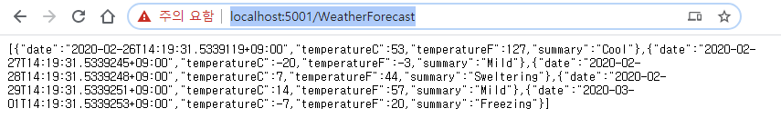

https://www.postman.com/downloads/
    SSL 인증서 확인을 사용하지 않도록 설정합니다.
        파일 > 설정(일반 탭)에서 SSL 인증서 확인을 사용하지 않도록 설정합니다.

dotnet new console -o .\Lesson3\Step1\ClientConsole
dotnet sln add .\Lesson3\Step1\ClientConsole

dotnet new webapi -o .\Lesson3\Step1\ServerWebapi
dotnet sln add .\Lesson3\Step1\ServerWebapi

C:\DistributedTracing\Tutorial> dotnet add .\Lesson3\Step1\ reference .\LessonLib\
C:\DistributedTracing\Tutorial> dotnet run --project .\Lesson3\Step1\ServerWebapi\

C:\DistributedTracing\Tutorial> dotnet run --project .\Lesson3\Step1\ServerWebapi\
info: Microsoft.Hosting.Lifetime[0]
      Now listening on: https://localhost:5001
info: Microsoft.Hosting.Lifetime[0]
      Now listening on: http://localhost:5000
info: Microsoft.Hosting.Lifetime[0]
      Application started. Press Ctrl+C to shut down.
info: Microsoft.Hosting.Lifetime[0]
      Hosting environment: Development
info: Microsoft.Hosting.Lifetime[0]
      Content root path: C:\DistributedTracing\Tutorial\Lesson3\Step1\ServerWebapi

https://localhost:5001/WeatherForecast

dotnet add .\Lesson3\Step1\ClientConsole reference .\LessonLib\