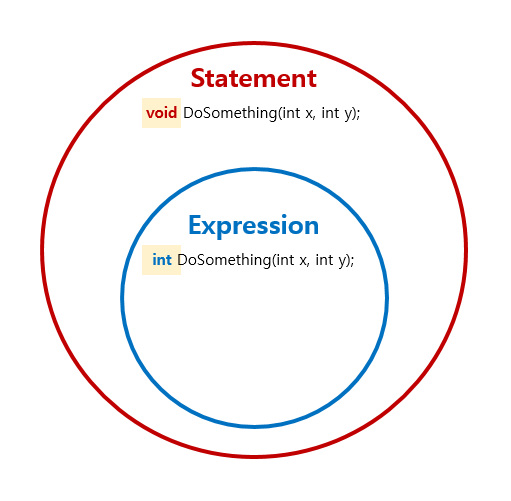

# 함수형

## 1. 함수
1. Expression vs. Statement
   - Expression 
     - [An expression in a programming language is **a syntactic entity** that **may be evaluated** to determine its value.](https://en.wikipedia.org/wiki/Expression_(computer_science))
     - **결과 값이 있다.**
     - 예. if 구문에 결과 값이 있다(then과 else는 expression만 허용한다).
       ```
       // F# IF 구문 
       // if boolean-expression then expression1 [ else expression2 ]
       //
      
       let test x y =
         if x = y then "equals"
         elif x < y then "is less than"
         else "is greater than"
      
       printfn "%d %s %d." 10 (test 10 20) 20
       ```
   - Statement
     - [a statement **only containing executable code** and a definition instantiating an identifier, while an expression evaluates to a value only.](https://en.wikipedia.org/wiki/Statement_(computer_science))
     - **결과 값이 없다.**
     - 예. if 구문에 결과 값이 없다(명시적으로 return 구문을 추가해야한다).
       ```
       // C# IF 구문
       // if (boolean-expression)
       // {
       //     statement;
       // }
       // else
       // {
       //     statement;
       // }
       //
      
       string Test(int x, int y)
       {
           if (x == y) return "equals";
           else if (x < y) return "is less than";
           else return "is greater than";
       }
       
       WriteLine($"10 {Test(10, 20)} 20");
       ```
   - Expression과 Statement 관계
     - [A statement may have internal components (e.g., expressions).](https://en.wikipedia.org/wiki/Statement_(computer_science))  
     
   - 왜 Expression이 중요한가?
     - 수학 함수 정의 : [첫 번째 집합의 임의의 한 원소를 두 번째 집합의 오직 한 원소에 대응시키는 이항관계다. ](https://ko.wikipedia.org/wiki/%ED%95%A8%EC%88%98)  
	   
	 - 수학 함수 f는 입력 x와 출력 y을 갖는다.
	 - Expression을 통해 프로그램 세계의 함수도 입력(argument type)과 출력(return type)을 갖는다(Statement은 출력이 선택적이다).
	 - Expression을 통해 프로그램 세계의 함수가 수학 함수 성질 중 "입력과 출력" 존재를 충족 시킨다.
1. Expression과 Declarative, Composition, Readable 관계
   ```
   Expression : Founction Name → Declarative ─────────────┐
      │                                                   ↘
     input/output : Function Signature → Pure → Predictable → Testable → Maintainable 
      ↓                                                   ↗
   Composition : Function Flow → Readable ────────────────┘  
   ```
1. Map vs. Bind vs. Return : Normal World vs Elevated World(Containerized)
   

## 2. 자료구조
1. 불변 vs. 가변

<br/>

## WHY. 단위 테스트
1. 명확해 진다.
   - 입/출력 중심 설계를 강요한다. : 사전 설계
   - 설계 준수를 강요한다. : 아키텍터 준수
   - 경우의 수를 누적 시킨다. : 기억 
   - 개발자 매뉴얼이다. : 실행가능한 문서

## 단위 테스트 패키지
1. 단위 테스트 기본 패키지 
   - 단위 테스트
     - xUnit
 	 - xUnit.Runner.VisualStuio, xUnit.Runner.Console
   - Arrange
     - AutoFixture
 	 - Moq
     - 의존성 컨테이너 : Microsoft.Extensions.DependencyInjection, Autofac
   - Assert
     - Fluent Assertion
 	 - Approval Tests 
1. 코드 커러비지 패키지
   - Microsoft 
 	 - Microsoft...Sdk
   - 코드 커버리지
     - Coverlet
 	 - HTML
1. 부작용 단위 테스트 패키지
   - Console : CommandLineApi
   - 환경 설정 : IOption<T>
   - 로그 : SeriLog
   - FileSystem : System.IO.Abstractions
   - HttpClient : Microsoft.Extensions.Http
   - ASP.NET Core : 
   - Blazor :
   - EF.Core : 
1. 화면 단위 테스트
   - Web
     - Selenium   
   - Desktop
1. 단위 테스트 방법론
   - 성능 단위 테스트
     - BenchmarkDotNet
	 - NBench
   - 속성 기반 단위 테스트
	 - FsCheck
	 - Expecto
   - BDD
     - Specflow
   - DB 
     - Scientist.NET
   - API 버전 관리
     - ApiApprovals
## 설계 원칙
1. 단위 테스트 정의 : 단위 테스트는 알고 있는 경우의 수를 메모리에서 테스트한다.
   - 알고 있는 경우의 수 : WHAT, 입/출력 정의
   - 메모리 : HOW
   - WHAT + HOW => any WHEN, any WHERE, any WHO 테스트할 수 있다. 예. CI/CD
1. 의존성 식별한다.
   - `new`키워드는 후보
   - 불순(Impure) 메서드
   - 정적 메서드
   - 싱글톤
1. 의존성 관리
1. 주 흐름을 식별한다.
   - 주 흐름 : Pipe 라인(마지막 인자, Curry)
   - 보조 흐름 : 사전 연결
1. Primitive obsession 

  
## 예제
1. 경우의 수 테스트 제약
   - 알고 있는 경우의 수를 테스트하는 것이다.
   - 알고 있는 경우의 수를 테스트할 수 없는 사례를 확인한다.
   - 점심시간 확인하기
     ```cs
	 bool IsLunchTime(DateTime time)
	 {
	 	return time.now... 12시 ~ 13시 사이면 true
	 }
	 
	 [Fact]
	 public 점심시간일_때()
	 {
	 	...
	 }
	 
	 [Fact]
	 public 점심시간이_아닐때()	// ...
	 {
	 	...
	 }
	 ```
1. 불순 함수(의존성) 식별 방법
1. DI 장점
   - Promotes loose coupling of components
     - 관련된 여러 코드를 변경시켜야 한다.  
       vs. 관련된 코드 한 곳을 변경시킨다(지역성)  
   - Promotes logical abstraction of components
     - 코드를 변경 시킨다.  
       vs. 코드를 변경 시키지 않는다.  
   - Supports unit testing
     - 경우의 수를 코드화할 수 없다.  
       vs. 경우의 수를 코드화할 수 있다.  
   - Clearner, more readable code
