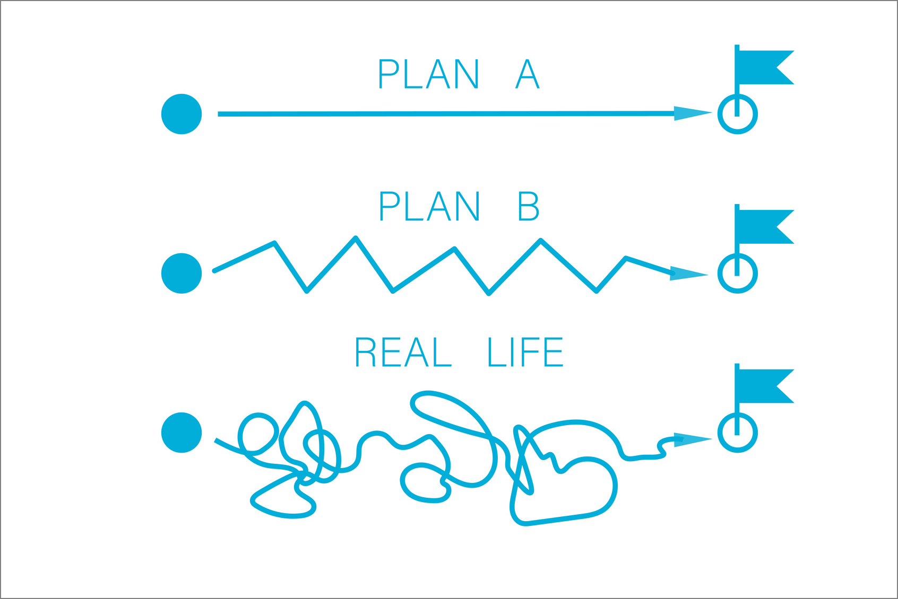

- **제대로 작동**하는 소프트웨어를 **정기적**으로 **고객에게 전달**하는 것이다.
  - 세분화
  - 집중
  - 작동
  - 피드백
  - **계획 변경**
  - 책임감
+ **변화**를 두려워하거나 피하려 하지 않는다(우선순위를 정한다).
  - 요구사항(피드백)은 프로젝트를 진행하면서 찾아내는 것이다.
  - **계획 변경**
- **계획 변경**
  - Plan A : 이상
  - **Plan B : 우리가 가야할 지향점**
  - Plan C : 우리의 현실  
  
    - [7 effective metrics for successful scrum projects delivery](https://www.blog.soldevelo.com/7-effective-metrics-for-successful-scrum-projects-delivery/)
