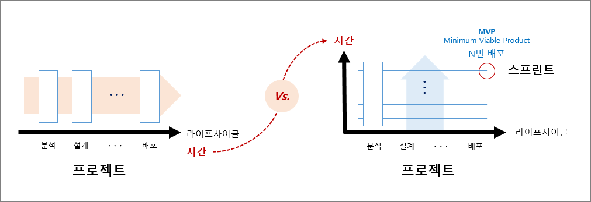

# 2장. 애자일 팀 만나기

- 각각의 **역할**을 미리 정의하지 않는다. 
  - **누구나 무슨 일이든 할 수 있다(불분명한 역할분담, 교차기능팀: Cross-Functional Team).**
    - 왜? 우리 모두는 한 배를 탄 하나의 팀이다.
    - 어떻게? 누가 어떤 역할을 맡는지보다 각 역할이 제대로 수행될 수 있는지에 더 초점을 맞춘다.
      - 나의 역할은 구체적이지 않으며 누구나 여러가지 역할을 수행할 수 있다.
  - 책임감과 자율성
    - 모두가 다 자율적으로 일하고 싶어하지 않는다.
    - 일부는 명확한 업무 지시에 따라 일하고 싶어한다.

+ 애자일 프로젝트란?
  - 출시를 반복한다 : 작동하는 소프트웨어
  - 업무(분석, 설계, ..., 배포)를 반복한다 : 빠른 피드백  
  

- 애자일 프로젝트 구성원의 소양(素養 : 평소에 닦고 쌓아 바탕이 된 교양)
  - 제너럴리스트 : 교차기능팀
  - **애매모호한 상황을 개의치 않는 사람** : 변화구를 기다리는 타자(성장 기회)
  - 팀 플레이어 : 교차기능팀
