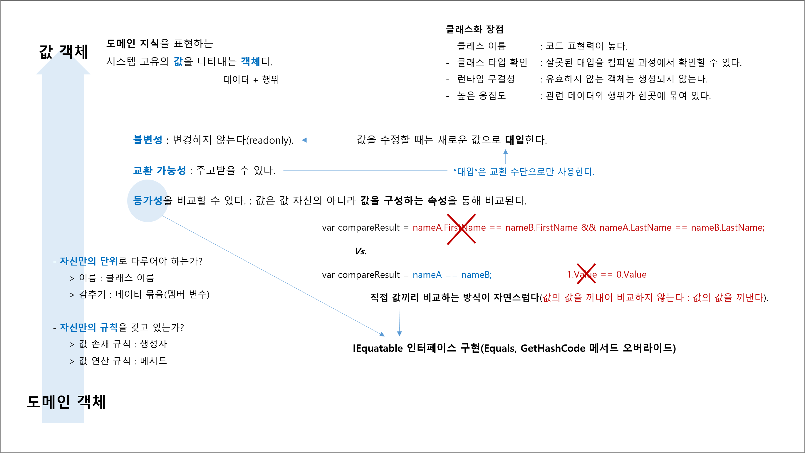

## Chaper 2. 시스템 특유의 값을 나타내기 위한 '값 객체'

## 개념 정리

## 값 객체
- 도메인 지식을 표현하는 시스템 고유의 값을 나타내는 객체다.
  - 값을 `낱개`로 다루어야 하는가?
    - 이름 : 클래스
    - 데이터 묶음 : 멤버 변수
  - 값은 `규칙`이 존재하는가?
    - 존재 규칙 : 생성자
    - 연산 규칙 : 메서드

## 값 객체 특정
1. 불변 : 생성 후 변경하지 않는다.
1. 교환 가능성 : `=` 대입문은 교환 외의 수단으로 사용하지 않는다(변경 : x).
1. 등가성 : IEquatable 인터페이스 구현
   - 값을 구성하는 속성을 통해 비교된다.
   - 값끼리 비교한다(값의 값을 꺼내어 비교하지 않는다).