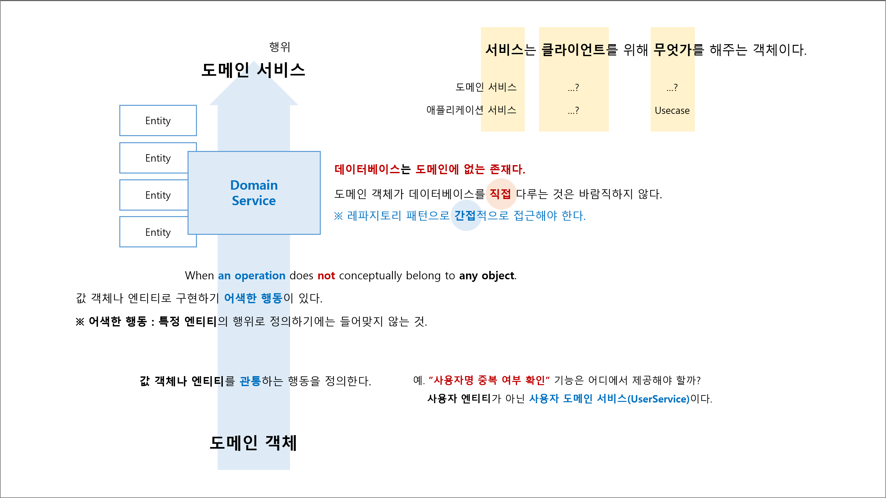

## 4장. 부자연스러움을 해결하는 '도메인 서비스'

## 요약

## 도메인 서비스 정의
- `값 객체`나 `엔티티`를 관통하는 행동을 정의한다.
  - `값 객체`나 `엔티티`로 구현하기 어색한 행동이 있다.
  - **어색한 행동** : 특정 엔티티의 행위로 정의하기에는 들어맞지 않는 것.  
    예. "사용자명 중복 여부 확인" 기능은 어디에서 제공해야 할까?  
        사용자 엔티티가 될 수 없다(자기 자신의 중복 여부를 확인한다? 뭔가 어색하다).    
        사용자 도메인 서비스이다.  

## 도메인 서비스 특징
1. 관통 : 값 객체나 엔티티를 관통하는 행동을 정의한다.

## 도메인 객체 주의점
1. 데이터베이스는 도메인에 없는 존재다.  
   도메인 객체(도메인 서비스)가 데이터베이스를 직접 다루는 것은 바람직하지 않다.  
   ※ 레파지토리 패턴으로 간접적으로 접근한다.
