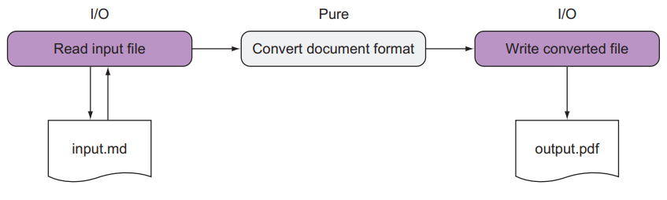

# Chapter 2. Why function purity matters

## 목차
- [Step 1. ManagingSideEffects](#step-1-managingsideeffects-예제)
- [Step 2. AvoidMutatingArguments](#step-2-avoidmutatingarguments-예제)

<br/>

## Step 1: ManagingSideEffects 예제

### 목표
- 불순 함수에서 순수 함수를 발견(설계)한다.
- 순수 함수를 코드에서 명시합니다([Pure] 속성).
- **순수 함수는 자연스럽게 SRP(Single Responsibility Principle)을 준수하게 된다.**
- 순수 함수를 확장 함수로 만들어 함수를 연결 시킨다(함수 합성).

### Stage 1: 불순 함수
- 문제점: 파일 시스템에 의존한다(SideEffects 함수 Signature에 정의가 안된 파일 시스템에 의존한다).
- 예
  ```cs
  public void SideEffects()
  {
     WriteLine("Enter your name:");
     var name = ReadLine();
     WriteLine($"Hello {name}");
  }
  ```

### Stage 2: 순수 함수
- 개선점
  - 불순 함수에서 순수 함수를 발견하여 분리 시킨다.
  - [Pure] 애트리뷰트를 이용하여 순수 함수임을 명시한다.
  - PureAttribute 클래스: [링크](https://docs.microsoft.com/ko-kr/dotnet/api/system.diagnostics.contracts.pureattribute?view=netframework-4.8)
- 예
  ```cs
  using System.Diagnostics.Contracts;
  
  [Pure]
  public string GreetingFor(string name) =>
     $"Hello {name}";
  ```
- 순수 함수와 불순 함수 분리  
    
  
### Stage 3: 순수 함수 합성
- 개선점: 함수를 연결 시킬 수 있다(함수 합성).
- 예
  ```cs
  var greet = ReadLine().GreetingFor();
  
  public static class StringExt
  {
     [Pure]
     public static string GreetingFor(this string self) =>
        $"Hello {self}";
  }
  ```
  
## Step 2: AvoidMutatingArguments 예제

### 목표
- 불순 함수을 순수 함수로 개선한다.
- 입력 값 변경에서 출력 값 생성(반환)으로 순수 함수를 구현한다.

### Stage 1: 불순 함수
- 문제점: 입력 값(linesToDelete)을 변경한다.
- 예
  ```cs
  public decimal RecomputeTotal(Order order, List<OrderLine> linesToDelete)
  {
      var result = 0m;
      foreach (var line in order.OrderLines)
      {
          if (line.Quantity == 0) 
              linesToDelete.Add(line);
  
          else 
              result += line.Product.Price * line.Quantity;
      }
          
      return result;
  }
  ```

### Stage 2: 순수 함수
- 개선점: 입력 값(```linesToDelete```) 변경에서 출력 값 생성(반환, ```IEnumerable<OrderLine>```)으로 변경한다(순수 함수).
- 예
  ```cs
  [Pure]
  public (decimal, IEnumerable<OrderLine>) RecomputeTotal(Order order) =>
       (order.OrderLines.Sum(l => l.Product.Price * l.Quantity),
          order.OrderLines.Where(l => l.Quantity == 0));
  ```
