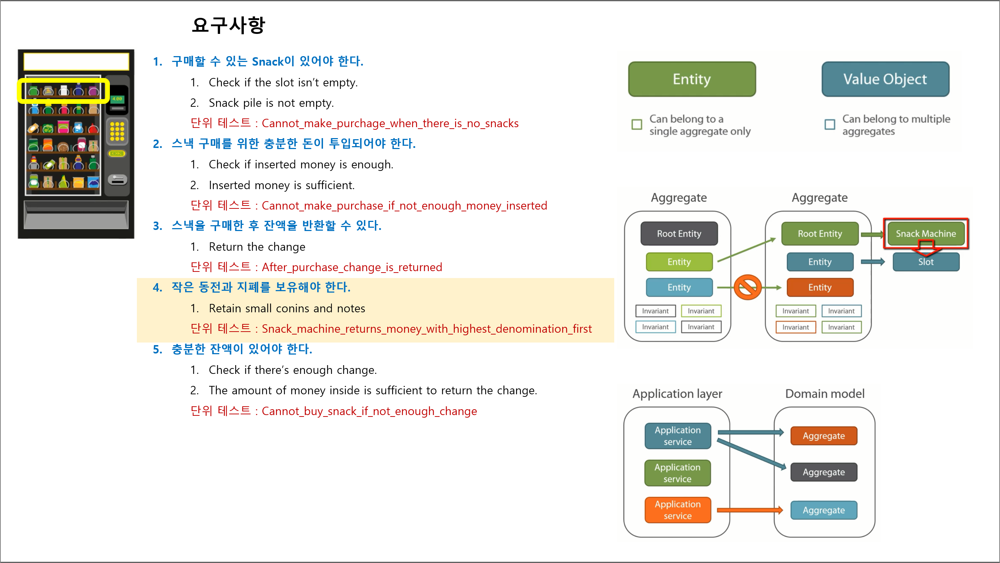

## 4장. Aggregate

## 목차
1. 요약
1. 목표
1. 개발

<br/>

## 1. 요약


<br/>

## 2. 목표
1. Aggregate Root 정의 및 설계
1. Entity 노출 문제 개선(More Abstraction : Entity와 Value Object 발굴)

<br/>

## 4. 개발

### Step 1. Aggregate Root
1. 요구사항 구현
   - [x] 스낵머신 Slot은 최대 3개이다(Slot 단위로 스낵이 위치한다).  
         3 slots of snacks
1. 단위 테스트 시나리오
   - ~~`Money_in_transaction_goes_to_money_inside_after_purchase`~~ -> `BuySnack_trades_inserted_money_for_a_snack`
1. Aggregate Root 정의
   - 하나의 추상화 아래 여러 Entity을 모여 도메인 모델을 단순화시키는 디자인 패턴이다.
     - 응집(Root Entity) : 개념적 전체이다.
     - 유효성 검사(불변식?) : 여러 Entity가 생애 동안 유지해야하는 불변식을 가지고 있다.
     - 접근(불변식 보호) : Root Entity을 통해서 자식 Entity을 접근해야 한다(Value Object는 불변 객체이기 때문에 노출 가능하다).
       - 추상화가 더 필요할 때 : Entity의 개별 속성 접근을 위한 메서드를 정의한다.
       - 추상화 방법 : 새로운 Value Object 발굴을 고려해야 한다.
     - 저장소 최소 단위(데이터 일관성 유지) 
   - 규칙
     - 개념적 묶음이다 : Fully encapsulated aggregate
     - Entitiy을 노출하지 않는다 : Not exposing internal Slot entity
     - Value Object는 노출할 수 있다 : Exposing SnackPile value object instead
     - Biz.을 추상화한다 : New abstraction to resolve the awkwardness
1. Aggregate Root 선별 기준
   - Entity 수명(Lifespan)의 부모다.
   - 일관성(불변식, 트랜잭션)이 최소 단위다.
1. Aggregate Root 설계
   - SnackMachine 문제점 : `public IList<Slot> Slots { get; protected set; }`  
     - IList가 노출되면 Slot은 3개만 존재한다(불변 규칙)을 위반할 수 있다.  
     - Aggregate Root을 거치지 않고 가변 객체 Slot `Entity`가 노출된다.  
       가변 도메인 객체가 노출되면 불변 규칙을 준수할 수 없다.

### Step 2. More Abstraction
1. 추상화하기
   - 리팩토링 전
     ```cs
     public class Slot : Entity
     {
          public virtual Snack Snack { get; set; }
          public virtual int Quantity { get; set; }
          public virtual decimal Price { get; set; }
          ...
     }
     ```
   - 리팩토링 후
     ```cs
     public class Slot : Entity
     {
          public virtual SnackPile SnackPile { get; set; }
     }

     public sealed class SnackPile : ValueObject<SnackPile>
     {
          public Snack Snack { get; }
          public int Quantity { get; }
          public decimal Price { get; }
          ...
     }
     ```
1. 값 객체는 불변이다
   - 대입을 통해 교환한다(변경한다).
   - 리팩토링 전
     ```cs
     slot.Quantity--;
     ```
   - 리팩토링 후
     ```cs
     
     slot.SnackPile = slot.SnackPile.SubtractOne();

     public sealed class SnackPile : ValueObject<SnackPile>
     {
          public SnackPile SubtractOne()
          {
               // 새로 생성한다.
               return new SnackPile(Snack, Quantity - 1, Price);
          }
          ...
     }
     ```

### Step 3. 요구사항
1. 요구사항 구현
   - 구매할 수 있는 Snack이 있어야 한다.  
     Check if the slot isn’t empty.  
     Snack pile is not empty.  
     - 단위 테스트 : `Cannot_make_purchage_when_there_is_no_snacks`
   - 스낵 구매를 위한 충분한 돈이 투입되어야 한다.  
     Check if inserted money is enough.  
     Inserted money is sufficient.  
     - 단위 테스트 : `Cannot_make_purchase_if_not_enough_money_inserted`
   - 스낵을 구매한 후 잔액을 반환할 수 있다.  
     Return the change  
     - 단위 테스트 : `Snack_machine_returns_money_with_highest_denomination_first`
     - 단위 테스트 : `After_purchase_change_is_returned`
   - 충분한 잔액이 있어야 한다.  
     Check if there’s enough change.  
     The amount of money inside is sufficient to return the change.  
     - 단위 테스트 : `Cannot_buy_snack_if_not_enough_change`
   - **발굴한 새 요구사항 : 작은 동전과 지폐를 보유해야 한다.**    
     Retain small conins and notes
1. 돈
   - 잔액 vs. ~~투입한 금액~~ => 잔액 vs. 투입한 **동일한** 금액
   - 리팩토링 전
     ```cs
     public virtual Money MoneyInside { get; protected set; }
     public virtual Money MoneyInTransaction { get; protected set; }
     ```
   - 리팩토링 후
     ```cs
     public virtual Money MoneyInside { get; protected set; }
     public virtual decimal MoneyInTransaction { get; protected set; }
     ```


### Step 2.
- 사용자가 투입한 돈 반환 vs. 사용자가 투입한 돈과 동일한 금액 반환 
