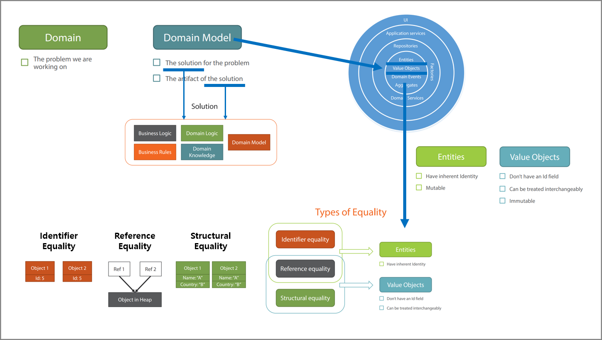

## Chaper 2.

## 개념 정리


### 1. 도메인 모델
1. Domain Model  
   == Domain Logic  
   == Domain Knowledge  
   == Business Logic  
   == Business Rules  
1. Domain vs. Domain Model
   - Domain : The problem we are working on
   - Domain Model : The solution for the problem, The artifact of the solution  

### 2. 동등
1. Types of Equality(동등) vs. 동일(==)
   - Identifier Equality : id
   - Reference Equality : Reference
   - Structural Equality : Properties

### 3. Value Object vs. Entity
1. Value Object
   - Lifecycle을 갖지 않는다.
   - 불변성(값은 어디에 있든 같다.) : 교환가능한다(Interchangeable).
   - Id을 갖지 않는다.
   - Equality : Reference Equality, Structural Equality
1. Entity
   - Lifecyce을 갖는다.
   - 가변성 : 교환 불가능한다.
   - Id을 갖는다.
   - Equality : Reference Equality, Identifier Equality
1. 차이점
   | 구분            | Entity     | Value Object |
   |-----------------|:----------:|:------------:|
   | Lifecycle       | O          | X            |
   | Immutable       | X          | O            |
   | Identity        | O          | X            |
   | Interchangeable | X          | O            |
   ----
   | Equality            | Entity | Value Object |
   |---------------------|:------:|:------------:|
   | Identifier Equality | O      | X            |
   | Reference Equality  | O      | O            |
   | Structural Equality | X      | O            |

<br/>

## 예제
### 1. Pluralsight
1. Value Object 요구사항
   - [x] Generic 타입 
   - [x] Properties 비교 : Equals, ==, !=
   - [ ] GetHashCode 성능 최적화
   - [ ] Generic 타입 제공 이해 : `public abstract class ValueObject<T> where T : ValueObject<T>`
   - [ ] GetHashCode 이해
1. Entity
   - [ ] Entity Id 재정의
   - [ ] Entity Equals 단위 테스트
   - [ ] Fluent Assertions ShouldBeEquivalentTo -> ?

### 2. ABP Framework
1. Value Object 차이점
   ```
   public abstract class ValueObject
   {
        protected ValueObject();

        public bool ValueEquals(object obj);
        protected abstract IEnumerable<object> GetAtomicValues();
   }
   ```
   - `Equals`이 아닌 `ValueEquals`을 사용해야 한다.
   - `GetAtomicValues`을 구현해야 한다.
   - `GetHashCode`을 제공하지 않는다.
1. Entity 차이점
   - [ ] Entity Id 재정의
   - [ ] Entity Equals 단위 테스트
   
### 3. eShopOnContainers
1. Value Object
   - `protected override IEnumerable<object> GetEqualityComponents()`을 구현해야 한다(abstract : o).
   - `Equals`을 사용할 수 있다.
   - `GetHashCode`을 제공한다.
1. Entity
   - [ ] Entity Id 재정의
   - [ ] Entity Equals 단위 테스트

### 4. Akkatecture
1. Value Object
   - `protected override IEnumerable<object> GetEqualityComponents()`을 구현할 수 있다(abstract : x).
   - `Equals`을 사용할 수 있다.
   - `GetHashCode`을 제공한다.
1. Entity
   - Id을 명시적으로 정의해야 한다.
     ```cs
     using Akkatecture.Core;
     using Akkatecture.ValueObjects;
     using Newtonsoft.Json;

     [JsonConverter(typeof(SingleValueObjectConverter))]
     public class SnackMachineId : Identity<SnackMachineId>
     {
         public SnackMachineId(string entityId)
             : base(entityId)
         {
         }
     }
     ```