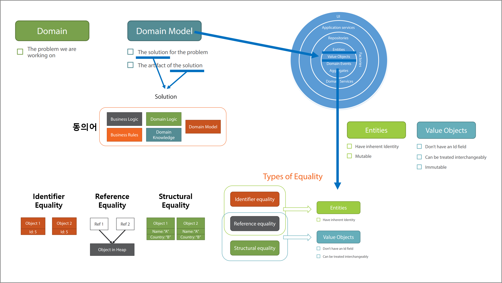

# 2장. Value Object vs. Entity

## 목차
1. 요약
1. 목표
1. 구현 방법론
1. 용어
1. 개발
1. DDD 패키지 비교

<br/>

## 1. 요약


<br/>

## 2. 목표
1. 스낵머신 요구사항으로 구현 방법론을 실천한다.
   - Core Domain을 정의한다(돈을 투입한다, 돈을 반환한다, 스낵을 구매한다).
   - 추상화 요소를 발굴한다(돈).
   - Core Domain을 단위 테스트로 검증한다.
1. Entity vs. Value Object을 이해하고 이를 구현한다.
   - Entity : `SnackMachine`
   - Value Object : `Money`

<br/>

## 3. 구현 방법론
1. 시작점 : 주요 기능부터
   - Start with the core domain.
   - Start off by working on the core domain
1. 방향 : 상향식 발전(bottom-up approach)
   - Don't introduce serveral bounded contexts upfront.
   - Begin with a single bounded context.
1. 발굴 : 캡슐화
   - Always look for hiddden abstractions.
   - Constantly search for hidden abstractions.

<br/>

## 4. 용어
1. Domain vs. Domain Model
   - Domain : The problem we are working on
   - Domain Model : The solution for the problem, The artifact of the solution  
1. Domain Model 동의어 
   - Domain Logic  
   - Domain Knowledge  
   - Business Logic  
   - Business Rules 

<br/>

## 5. 개발

### Step 1. 스낵머신 요구사항
1. 스낵머신(`class StackMachine`) 기능을 정의합니다.
   - 돈을 투입한다.
   - 돈을 반환한다.
   - 스택을 구매한다.
1. **돈을 구분합니다.**
   - 스낵머신에 현재 있는 돈(`Money Inside`).  
   - 스낵머신에 고객이 투입한 돈(`Money In Transaction`).  
     ※ 고객이 반환을 요청할 때 돈을 구분할 수 있어야 하기 때문이다.

### Step 2. 추상화
1. 돈(`class Money`)을 추상화합니다.
   - 여러 단위를 돈으로 묶는다.
     ```cs
     public sealed class Money
     {
        public int OneCentCount { get; private set; }
        public int TenCentCount { get; private set; }
        public int QuarterCount { get; private set; }
        public int OneDollarCount { get; private set; }
        public int FiveDollarCount { get; private set; }
        public int TwentyDollarCount { get; private set; }
     }
     ```

### Step 3. Entity vs. Value Object
1. Entity와 Value Object을 이해한다.
   
   | 구분            | Entity     | Value Object |
   |-----------------|:----------:|:------------:|
   | Equality        | Identifier | Structural   |
   | Immutable       | X          | O            |
   | Lifespan        | O          | X            |
   ----
   | Equality            | Entity | Value Object |
   |---------------------|:------:|:------------:|
   | Identifier Equality | O      | X            |
   | Reference Equality  | O      | O            |
   | Structural Equality | X      | O            |

   - Entity 
     - **Identifier equality** : 동명이인(같은 이름을 가진 다른 사람이지만 서로 구별되어야 한다)
       - 정체성(Identity)을 갖는다.
       - 가변(Mutable) : 교환 불가능하다.
     - **Lifespan을 갖는다.**
       - 혼자 존재할 수 있다.
   - Value Object
     - **Structural equality** : 속성으로 구분한다.
       - 정체성(Identity)을 갖지 않는다.
       - 불변(Immutable) : 교환 가능하다(Interchangeable).
     - **Lifespan을 갖지 않는다.**
       - 혼자 존재할 수 없다(Entity 속성이 된다).
     - .NET Value Type 차이점과 공통점
       - 차이점 
         - Value Object : 설계 개념
         - .NET Value Type : 구현 개념
       - 공통점
         - Structural equality
         - 불변  
           ※ `x.Clear();` 메서드 제공하면 `가변`이 된다.  
             불변(생성후 변경하지 않는다)을 제공하기 위해서는 `대입`을 이용한다.  
              > 변경 전 : x.Clear();  
              > 변경 후 : x = new X(); 또는 x = None;  
                   public static readonly X None = new X();  
1. Entity와 Value Object을 위한 클래스를 구현한다.
   - `Entity`
   - `ValueObject<T>`
   - `IEquatable<T>` : .NET Value Type 비교를 위해 필요한 인터페이스다(Bocking과 Unboxing을 제거한다).  
     모든 것이 Reference 타입으로 구현되기 때문에 KISS 원칙을 준수하기 위해 `IEquatable<T>`을 구현하지 않는다.  
1. Entity와 Value Object을 정의한다.
   - `Entity` : StackMachine
   - `ValueObject<T>` : Money
     - Money은 Structural equality을 구현한다. : `bool EqualsCore(Money other)`, `int GetHashCodeCore()`
     - 속성을 불변으로 만든다.
       - 변경 전 : `public int OneCentCount { get; set; }`
       - 변경 후 : `public int OneCentCount { get; private set; }`
       - 변경 후(C# 6.0) : `public int OneCentCount { get; }`, readonly
   
### Step 4. Money Unit Tests
1. `Money` 클래스 단위 테스트 시나리오
   - 객체 생성
     - `Cannot_create_money_with_negative_value` : Money 클래스 생성 유효성 : 음수를 받지 않는다.
   - Structual equality 비교
     - `Two_money_instances_equal_if_contain_the_same_money_amount` : 속성이 같다면 같다.
     - `Two_money_instances_do_not_equal_if_contain_different_money_amounts` : 속성이 다르면 다르다.
   - "+"와 "-" 연산자
     - `Sum_of_two_moneys_produces_correct_result` : "+" 연산을 제고한다.
     - `Subtraction_of_two_moneys_produces_correct_result` : "-" 연산을 제공한다.
     - `Cannot_subtract_more_than_exists` : 음수 결과(돈)는 제공하지 않는다.
   - 총합
     - `Amount_is_calculated_correctly` : 총합을 계산한다.
1. `Money` 클래스 개선
   - 유효하지 않는 객체 생성을 방지한다.
   - "-" 연산자를 제공한다.
   - 총합(Amount)을 표현한다.

### Step 5. SnackMachine Unit Tests
1. `SnackMachine` 클래스 단위 테스트 시나리오
   - Insert Money 규칙
     - `Inserted_money_goes_to_money_in_transaction` : 돈을 투입한다.
     - `Cannot_insert_more_than_one_coin_or_note_at_a_time` : 한번에 여러 단위의 돈을 투입할 수 없다.
   - Rutrun Money 규칙
     - `Return_money_empties_money_in_transaction` : 돈을 반환한다.
   - Buy Money 규칙
     - `Money_in_transaction_goes_to_money_inside_after_purchase` : 스낵을 구매하면 투입한 돈은 스낵머신이 관리한다.
1. `Money` 클래스 개선
   - 생성 과정을 단순화하고 더 명확하게 제공한다.
     ```cs
     public static readonly Money None = new Money(0, 0, 0, 0, 0, 0);
     public static readonly Money Cent = new Money(1, 0, 0, 0, 0, 0);
     ```
1. `SnackMachine` 클래스 개선
   - 누락되었던 객체를 초기화한다.
   - InsertMoney에서 유요한 입력을 체크한다. : 단위 별로만 입력을 제공한다.
     ```cs
     var twoCent = Cent + Cent;
     ```
   - 불변을 단순화하고 더 명확히 기술한다.
     ```cs
     // 가변
     // MoneyInTransaction.Clear();   

     // 불변 : 대입을 통해 가변을 제공한다.
     MoneyInTransaction = None;
     ```

<br/>

## 6. DDD 패키지 비교

### ABP Framework
1. Value Object 차이점
   ```
   public abstract class ValueObject
   {
        protected ValueObject();

        public bool ValueEquals(object obj);
        protected abstract IEnumerable<object> GetAtomicValues();
   }
   ```
   - `Equals`이 아닌 `ValueEquals`을 사용해야 한다.
   - `GetAtomicValues`을 구현해야 한다.
   - `GetHashCode`을 제공하지 않는다.
1. Entity 차이점
   - [ ] Entity Id 재정의
   - [ ] Entity Equals 단위 테스트
   
### eShopOnContainers
1. Value Object
   - `protected override IEnumerable<object> GetEqualityComponents()`을 구현해야 한다(abstract : o).
   - `Equals`을 사용할 수 있다.
   - `GetHashCode`을 제공한다.
1. Entity
   - [ ] Entity Id 재정의
   - [ ] Entity Equals 단위 테스트

### Akkatecture
1. Value Object
   - `protected override IEnumerable<object> GetEqualityComponents()`을 구현할 수 있다(abstract : x).
   - `Equals`을 사용할 수 있다.
   - `GetHashCode`을 제공한다.
1. Entity
   - Id을 명시적으로 정의해야 한다.
     ```cs
     using Akkatecture.Core;
     using Akkatecture.ValueObjects;
     using Newtonsoft.Json;

     [JsonConverter(typeof(SingleValueObjectConverter))]
     public class SnackMachineId : Identity<SnackMachineId>
     {
         public SnackMachineId(string entityId)
             : base(entityId)
         {
         }
     }
     ```