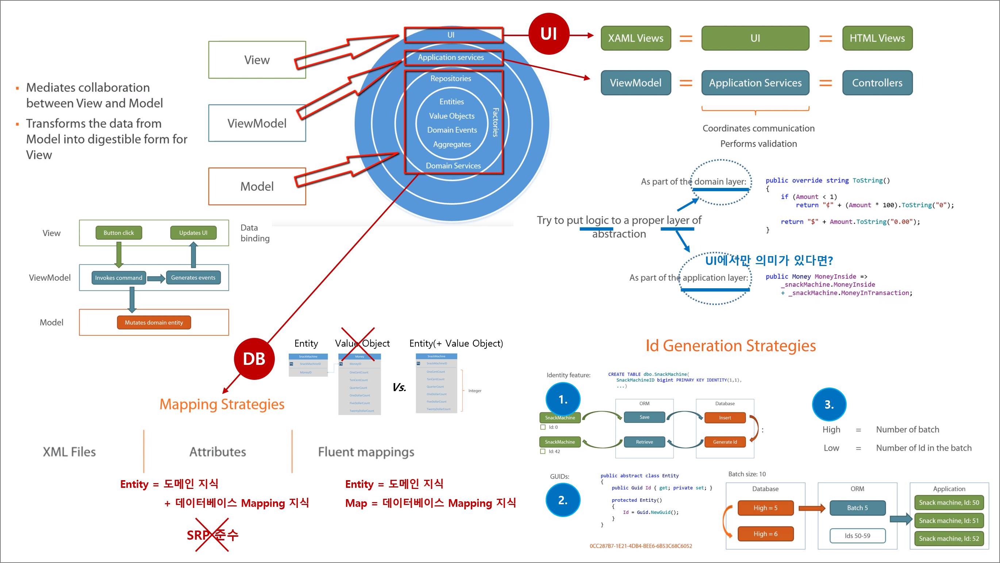
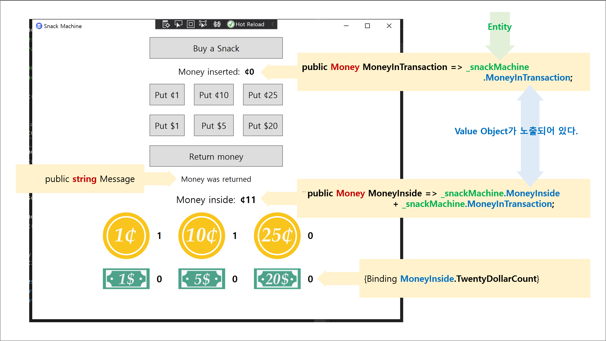

## Chaper 3. UI와 DB 연동하기

## 목차
1. 요약
1. 목표
1. MVVM Binding
1. 개발

<br/>

## 1. 요약


<br/>

## 2. 목표
1. MVVM 패턴 기반으로 UI 구현
1. NHibernate ORM 기반 데이터 복원 및 저장
   - Id 만들기 : Hi/Lo 알고리즘

<br/>

## 3. MVVM Binding


<br/>

## 4. 개발

### Step 1. 화면
1. ViewModel
   - 화면 전용 유스케이스를 구현한다.
     - 총합
     ```cs
     public Money MoneyInside => _snackMachine.MoneyInside 
                                    + _snackMachine.MoneyInTransaction;
     ```
1. Domain
   - 도메인 규칙을 구현한다.
     ```cs
     public sealed class Money : ...
     { 
         public override string ToString()
         {
             if (Amount < 1) { ... } // 동전
             else { ... } // 지폐
         }
     }
     ```
   - Entity는 ViewModel Binding을 위해 Value Object를 읽기 전용으로 노출한다.
     ```cs
     public Money MoneyInTransaction => _snackMachine.MoneyInTransaction;
     ```
1. `Money` 클래스 단위 테스트 시나리오
   - `To_string_returns_correct_string_representation` : 돈의 단위 표현(동전 또는 지폐)을 확인한다.

### Step 2. 데이터베이스
1. MS SQL Server 개발 환경 구성
   - Developer 다운로드 : [링크](https://www.microsoft.com/ko-kr/sql-server/sql-server-downloads)
   - [SQL Server 2019 Express 외부 접속을 위한 처리](https://www.098.co.kr/sql-server-2019-express-%EC%99%B8%EB%B6%80-%EC%A0%91%EC%86%8D%EC%9D%84-%EC%9C%84%ED%95%9C-%EC%B2%98%EB%A6%AC/)
1. Entity와 Value Object 테이블
   - Value Object는 Entity와 통합 시킨다.
     - Value Object는 Id을 갖기 않기 때문이다.
     - Value Object은 Entity 없이 스스로 존재할 수 없다(Lifespan이 없다).
1. Id 생성 방법
   - DB Id : x
     - Unit of Work 개념과 맞지 않는다.
   - Guid : O
   - Hi/Lo 알고리즘 : O
1. NHibernate ORM
   - NuGet 패키지 : NHibernate 낮은 버전을 사용하기 위해 .NET Frmaeowkr 4.8을 사용한다.
     - NHibernate : **4.0.4.4000**
     - FluentNHibernate : **2.0.3**
   - SessionFactory 클래스 구현
     - 테이블 작성 규칙
     - Id 생성 규칙 : Hi/Lo 알고리즘
   - DB 요구사항
     - DB 접속 : App 생성자
     - DB 데이터 복원 : MainViewModel 생성자
     - DB 데이터 저장 : SnackMachineViewModel BuySnack 메서드
1. Entity와 NHibernate ORM 통합 규칙
   - `Entity` 구현 클래스 : SnackMachine
     - `sealed` 제거
     - `virtual` 추가
     - setter 변경 : `private` -> `protected`
     - 생성자 추가 : `private constructor
   - `Entity` 클래스
     - 모든 규칙 적용 
     - Equal 메서드 개선 : NHibernateProxyHelper.GetClassWithoutInitializingProxy
