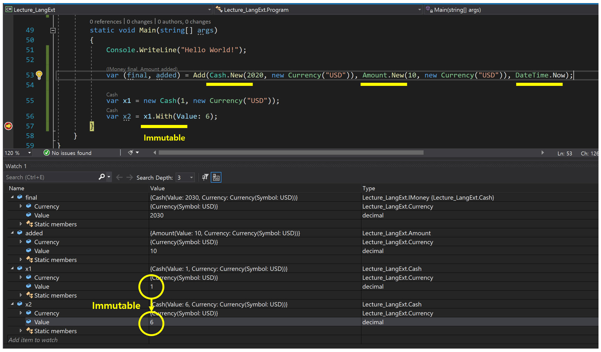

# Writing Purely Functional Code in C#
- 사이트 : [링크](https://app.pluralsight.com/library/courses/writing-purely-functional-code-csharp/table-of-contents)

## Ch 1. Understanding the Need for Discriminated Unions
1. Functional Concepts in C# 7.0
   - Func delegates
   - Lambdas
   - LINQ
   - Entension methods
   -  Anonymous types
   - Tuple literals
   - Pattern matching
   - Type inference
   - Generics
1. Writing Purely Functional Code
   - Function **evaluates**. it does not **execute**(Argument가 실행 단위다).
   - Result depeands on **arguments**, not on **state**.
   - Values do **not change**, etc.   
1. Making Your C# More Functional 
   - OO falling short
   - Object fileters
   - FP theory
     - Pure functions
	 - Referential transparency
	 - Memoization, etc
   - Pattern matching
   - Function composition
   - Railway-oriented programming
1. 배울 예정
   - Types vs. classes
   - Discriminated unions
   - Functional functions
     - What is the function in FP?
     - Function vs object method
     - Function composition
     - Higher-order functions
     - Partial function application, etc.
     - Applying functions to C#
   - Value -typed semantic
     - Custom value types
     - Tuples
     - Record types
   - Control flow	
     - Pattern matching
       - The only method of controlling execution flow in functional programming
       - Looping implemented via LINQ
   - Sequences
     - Functional sequence processing with LINQ
   - Immutable collections
   - Object-oriented Design vs. Functional Design
   - Understanding Class Inheritance : 행위(메서드) 재사용(0) vs. 데이터(상태) 재사용(X)
1. LanguageExt.Core
   - NuGet 패키지
     ```xml
     <ItemGroup>
       <DotNetCliToolReference Include="dotnet-codegen" Version="0.6.1" />
       <PackageReference Include="CodeGeneration.Roslyn.BuildTime" Version="0.6.1">
         <PrivateAssets>all</PrivateAssets>
         <IncludeAssets>runtime; build; native; contentfiles; analyzers; buildtransitive</IncludeAssets>
       </PackageReference>
       <PackageReference Include="LanguageExt.CodeGen" Version="3.4.15">
         <PrivateAssets>all</PrivateAssets>
       </PackageReference>
       <PackageReference Include="LanguageExt.Core" Version="3.4.15" />
     </ItemGroup>
     ```
   - Record type
     ```cs
	 [Record]
     public partial struct Amount
     {
         public readonly decimal Value;
         public readonly Currency Currency;
     }
	 ```
   - Discriminated Unions   
     ```cs
     [Union]
     public interface IMoney
     {
         IMoney Cash(decimal value, Currency currency);
         IMoney Gift(decimal value, Currency currency, DateTime validBefore);
     }
	 ```
   - Pattern matching
     ```cs
     static (IMoney final, Amount added) Add(IMoney money, Amount amount, DateTime at)
     {
         return money switch
         {
             Cash cash when amount.Currency == cash.Currency => (new Cash(cash.Value + amount.Value, cash.Currency), amount),
             Cash _ => (money, new Amount(0, amount.Currency)),

             Gift gift when at < gift.ValidBefore && amount.Currency == gift.Currency => (new Gift(gift.Value + amount.Value, gift.Currency, gift.ValidBefore), amount),
             Gift _ => (money, new Amount(0, amount.Currency)),

             //
             // Discriminated Unions 타입(IMoney : Cash, Gift) 경우의 수를 인식하지 못한다.
             // 모든 경우의 수를 제어하기 위해 '_'을 컴퍼일러는 요구한다(경고).
             //
             // Warning CS8509 
             //   The switch expression does not handle all possible values of its input type(it is not exhaustive). 
             //   For example, the pattern '_' is not covered.
             _ => throw new ArgumentException()
         };
     }
	 ```
   - 디버깅    
     