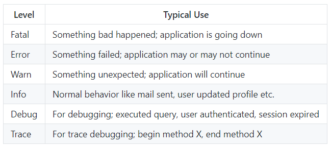
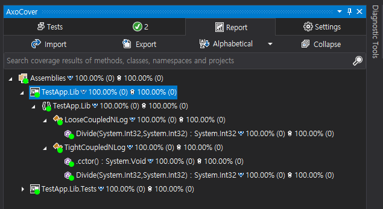

# 로그 정책

## 목차
1. **[NLog Log Levels](#1-nlog-log-levels)**
1. **[로그 출력 방법](#2-로그-출력-방법)**
1. **[로그 단위 테스트](#3-로그-단위-테스트)**

<br/>

## 1. NLog Log Levels
- [링크](https://github.com/NLog/NLog/wiki/Configuration-file#log-levels)  
  
- 로그 수준 목표
  - Fatal: 메서드 실행 중 예외 또는 조기 반환 이유를 출력한다.
  - Error: 메서드 실행 중 예외를 출력한다.
  - Warn: 메서드 실행 중 조기 반환 이유를 출력한다.
  - Info: 메서드 실행 목표를 출력한다.
  - Debug: 메서드 실행을 디버깅하기 위한 메서드 상태 값을 출력한다.
  - Trace: 메서드 실행을 추적하기 위한 메서드 시작과 종료를 출력한다.

## 2. 로그 출력 방법
1. **[+Trace: 메서드 실행을 추적하기 위한 메서드 시작과 종료를 출력한다.+]**
   - 대상
     - 필수: public 메서드
     - 선택: 생성자, private와 protected 메서드, 정적 메서드
   - 형식
     - 메서드 시작: Entered into 메서드명
     - 메서드 종료: Returned from 메서드명
   - 위치
     - 메서드 시작: 메서드의 첫 줄
     - 메서드 종료: 메서드의 마지막 줄
   - 예: 명시적 구현
     ```cs
     public int DoSomething()
     {
        _logger.Trace("Entered into DoSomething");  // 첫 줄
        ...
        _logger.Trace("Returned from DoSomething");   // (return 구문을 제외한) 마지막 줄
        return ret;
     }
     ```
   - 예: 암시적 구현
     - [Tracer](https://github.com/csnemes/tracer)을 이용하여 Trace 로그를 출력한다.
     - *Tracer 사용법은 향후 추가할 예정이다.*
     ```cs
     public int DoSomething()
     {
        ...
        return ret;
     }
     ```
1. **[+Debug: 메서드 실행을 디버깅하기 위한 메서드 상태 값을 출력한다.+]**
   - 형식: 없다(어떤 형식이든 가능하다).
   - 위치: 없다(Trace 로그 영역을 제외한 어디든 가능하다).
   - 예
     ```cs
     public int DoSomething(int x, int y)
     {
        _logger.Trace("Entered into DoSomething");  // 첫 줄
        _logger.Debug($"X: {x}, Y: {y}"); // 입력 값

        ...

        _logger.Debug($"Ret: {ret}");     // 출력 값
        _logger.Trace("Returned from DoSomething");   // (return 구문을 제외한) 마지막 줄
        return ret;
     }
     ```
1. **[+Info: 메서드 실행 목표를 출력한다.+]**
   - 조건: 메서드 실행이 성공할 때만 Info 로그를 출력한다.
     - **메서드와 Info 로그 관계는 "메서드 : Info 로그 = 1 : 1"이다(Single Responsibility Principle).**
   - 형식: 없다(메서드 비즈니스 목표를 기술할 수 있는 어떤 형식이든 가능하다).
   - 위치: 메서드 실행이 성공을 판단할 수 있는 곳에 위치한다(Trace 로그 영역을 제외한 어디든 가능하다).
   - 예
     ```cs
     public int DoSomething(int x, int y)
     {
        _logger.Trace("Entered into DoSomething");  // 첫 줄

        ...

        _logger.Info("DoSomething 비즈니스 목표를 기술한다.");
        _logger.Trace("Returned from DoSomething");   // (return 구문을 제외한) 마지막 줄
        return ret;
     }
     ```     
1. **[+Warn: 메서드 실행 중 조기 반환 이유를 출력한다.+]**
   - 조건: 조기 반환할 때 로그를 출력한다.
     - 조기 반환?
       - 입력 값이 유효(Validation)하지 않아 더 이상 진행하는 것이 의미가 없을 때이다.
       - Sub 메서드의 호출 결과가 유효하지 않아 더 이상 진행하는 것이 의미가 없을 때이다.
   - 형식: "WHAT. WHY. HOW."
     - WHAT: 달성하지 못한 목표를 기술한다. 
     - WHY: 조기 반환한 이유를 기술한다.
     - HOW: 조기 반환을 해결할 수 있는 방법을 기술한다(생략 가능).
   - 위치: 조기 반환 전에 위치한다.
   - 예
     ```cs
     public int DoSomething(int x, int y)
     {
        _logger.Trace("Entered into DoSomething");  // 첫 줄

        if (y == 0)
        {
            _logger.Warn($"DoSomething 비즈니스 목표를 달성할 수 없다. Y가 ({y})이다. Y는 0외의 값을 가져야 한다.");
            return -1;  // 조긴 반환
        }

        ...

        _logger.Info("DoSomething 비즈니스 목표를 기술한다.");
        _logger.Trace("Returned from DoSomething");   // (return 구문을 제외한) 마지막 줄
        return ret;
     }
     ```   
1. **[+Error: 메서드 실행 중 예외를 출력한다.+]**
   - 조건: 메서드 예외 처리에서 Exception을 출력한다.
   - 형식: 없다(Exception 클래스외 정보를 추가한다).
   - 위치: catch 블럭에 위치한다.
   - 예
     ```cs
     public int DoSomething(int x, int y)
     {
        _logger.Trace("Entered into DoSomething");  // 첫 줄

        try
        {
           ...
        }
        catch (Exception ex)
        {
           _logger.Error(ex, "예외 발생 이유를 기술한다.");
           throw;   // 로직 구현에 따라 예외 전파를 결정한다.
        }

        _logger.Info("DoSomething 비즈니스 목표를 기술한다.");
        _logger.Trace("Returned from DoSomething");   // (return 구문을 제외한) 마지막 줄
        return ret;
     }
1. **[+Fatal: 메서드 실행 중 예외 또는 조기 반환 이유를 출력한다.+]**
   - 조건: 예외 또는 조기 반환으로 더 이상 애플리케이션 실행이 의미가 없을 때 출력한다.
   - 형식: 
     - 조기 반환: "WHAT. WHY. HOW."
       - WHAT: 달성하지 못한 목표를 기술한다. 
       - WHY: 조기 반환한 이유를 기술한다.
       - HOW: 조기 반환을 해결할 수 있는 방법을 기술한다(생략 가능).
     - 예외: 없다(Exception 클래스외 정보를 추가한다).
   - 위치: 
     - 조기 반환: 조기 반환 전에 위치한다.
     - 예외: catch 블럭에 위치한다.
   - 예
     ```cs
     public DbConnection Connect(string connectionString)
     {
        _logger.Trace("Entered into Connect");  // 첫 줄
        _logger.Debug($"ConnectionString: {connectionString}"); // 입력 값

        if (string.IsNullOrEmpty(connectionString))
        {
            _logger.Fatal($"Connect할 수 없다. connectionString이 ({connectionString})이다.");
            return null;
        }

        try
        {
           ...
        }
        catch (Exception ex)
        {
           _logger.Fatal(ex, $"Connect할 수 없다. connectionString이 ({connectionString})이다.");
           throw;   // 로직 구현에 따라 예외 전파를 결정한다.
        }

        _logger.Info($"{IP}:{Port}, {Databse}에 {UserId}로 접속했다.");
        _logger.Debug($"Ret: {dbConnect}, ConnectionString: {connectionString}");     // 출력 값
        _logger.Trace("Returned from ConnectionString");   // (return 구문을 제외한) 마지막 줄
        return dbConnect;
     }
## 3. 로그 단위 테스트
- 목표
  - 로그 Level과 Message 테스트이다.
  - NLog.config 환경설정 기반의 결과물은 단위 테스트 대상이 아니다.
- 단위 테스트 개발 방법
  - 로그 출력을 MemoryTarget을 이용하여 메모리에서 확인한다.
  - MemoryTarget 단위 테스트 방법: [링크](https://github.com/NLog/NLog/blob/dev/tests/NLog.UnitTests/Targets/MemoryTargetTests.cs)
- 개발 환경
  - Visual Studio 2017
  - Code Coverage: [AxoCover](https://marketplace.visualstudio.com/items?itemName=axodox1.AxoCover)
    - Visual Studio 2017만 제공한다.
    - xUnit 2.2.0만 제공한다.
- App 프로젝트 
  - .NET Framework 4.5
  - NLog 4.7.0
  - Autofac 4.9.4
- Lib 프로젝트 
  - .NET Framework 4.5
  - NLog 4.7.0
- 단위 테스트 프로젝트
  - .NET Framework 4.5.2 이상
    - xUnit과 AxoCover가 4.5.2 이상에서만 동작한다.
  - NLog 4.7.0
  - xUnit 2.2.0
  - xUnit.Runner.VisualStudio 2.2.0
  - FluentAssertions 5.10.3
- 코드 커버리지 제외 시키기
  - 클래스 제외
    ```cs
    using System.Diagnostics.CodeAnalysis;
    
    [ExcludeFromCodeCoverage]
    public clsss Foo
    {
       // ...
    }
    ```
  - 메서드 제외
    ```cs
    using System.Diagnostics.CodeAnalysis;
    
    public clsss Foo
    {
        [ExcludeFromCodeCoverage]
        public Foo(ILogger logger)
        { 
            // ... 
        }
    }
    ```
- 예제 코드
  - 로직 코드
    ```cs
    public class TightCoupledNLog
    {
        // NLog는 Tight Coupled일 때도 단위 테스트가 가능하다.
        private static readonly Logger _logger = LogManager.GetCurrentClassLogger();

        public int Divide(int x, int y)
        {
            _logger.Trace("Entered into Divide");

            int ret = x / y;
            _logger.Info($"{x} / {y} = {ret}");

            _logger.Trace("Returned from Divide");
            return ret;
        }
    }
    ```
  - 단위 테스트 코드
    - 로그 출력 내용은 _memoryTarget.Logs에서 모두 확인할 수 있다.
    ```cs
    public class TightCoupledNLogSpec
    {
        private readonly MemoryTarget _memoryTarget;

        public TightCoupledNLogSpec()
        {
            _memoryTarget = new MemoryTarget
                {
                    Layout = "${level}"
                };

            SimpleConfigurator.ConfigureForTargetLogging(_memoryTarget, LogLevel.Trace);
        }

        [Fact]
        public void ShouldHave_TwoTraces()
        {
            // Arrange
            TightCoupledNLog sut = new TightCoupledNLog();

            // Act
            sut.Divide(2019, 10);

            // Assert
            _memoryTarget.Logs
                .Where(log => log.StartsWith("Trace"))
                .Count()
                .Should().Be(2);
        }
    }
    ```
  - xUnit 단위 테스트 병렬화 취소
    ```cs
    // AssemblyInfo.cs 파일
    [assembly: Xunit.CollectionBehavior(DisableTestParallelization = true)]
    ```
- 단위 테스트 코드 커버리지
  - 코드 커버리지  
    

