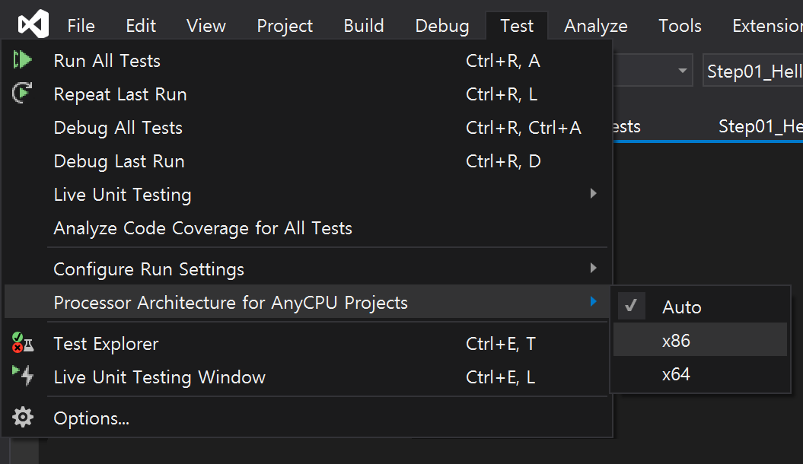

# Chapter 1. Start

## 목차
1. 단위 테스트 프로젝트 만들기 : Step 1. Helloworld
1. 자연어 형태의 Assert 구현하기 : Step 2. Fluent Assertion
1. 단위 테스트 실행하기
1. 코드 커버리지 확인하기
1. GitHub 자동화하기

## Step 1. Helloworld
### 1. 목표
- 단위 테스트 프로젝트를 생성한다.
- 단위 테스트를 생성한다.
- 단위 테스트를 Visual Studio에서 실행한다.

### 2. 단위 테스트 프로젝트 만들기
1. 단위 테스트 프로젝트명 규칙
   - `프로젝트명.[Tests]`
   - 예. 
     - 프로젝트명 : Step01_Helloworld
     - 단위 테스트 프로젝트명 : `Step01_Helloworld.Tests`
1. 단위 테스트 패키지 추가
   - xunit과 xunit.runner.visualstudio 버전을 동일 시킨다.
   - xunit 2.4.1
   - xunit.runner.visualstudio 2.4.1
1. 단위 테스트 클래스명 규칙
   - `클래스명Spec`
   - 예
     - 클래스명 : Calculator
     - 단위 테스트 클래스명 :  CalculatorSpec
1. 단위 테스트 만들기
   - `public` 단위 테스트 클래스 
   - `public void` 단위 테스트 메서드
     - `[Fact]` 단위 테스트 속성 추가
   ```cs
   using Xunit;

   public class CalculatorSpec  // 단위 테스트 클래스
   {
          [Fact]
          public void Xyz()     // 단위 테스트 메서드
          {
                // ...
          }
   }
   ```
1. 단위 테스트 구현
   - 3A 패턴
     - Arrange : 메서드 실행 준비
     - Act : 메서드 실행
     - Assert : 메서드 결과 값 확인
   ```cs
   public class CalculatorSpec
   {
        [Fact]
        public void Should_Add()
        {
            // Arrange: 준비
            Calculator calc = new Calculator();

            // Act: 수행
            int result = calc.Add(1, 2);

            // Assert: 확인
            Assert.Equal(3, result);
        }
   }
   ```
1. 단위 테스트 프로세스 아키텍처 설정
   - 단위 테스트 대상 플랫폼 기준으로 설정한다. : Auto, x86, x64  
   
1. 단위 테스트 실행
   - `Menu > Test > Test Explorer(Ctrl+E,T)`
   

<br/>

## Step 2. Fluent Assertion
### 1. 목표
- Assert 코드를 더 읽기 쉬운 코드(자연어 형태의 코드)로 변경한다. 

### 2. 자연어 형태의 Assert 구현하기
1. 패키지 추가
   - FluentAssertions : 5.10.3