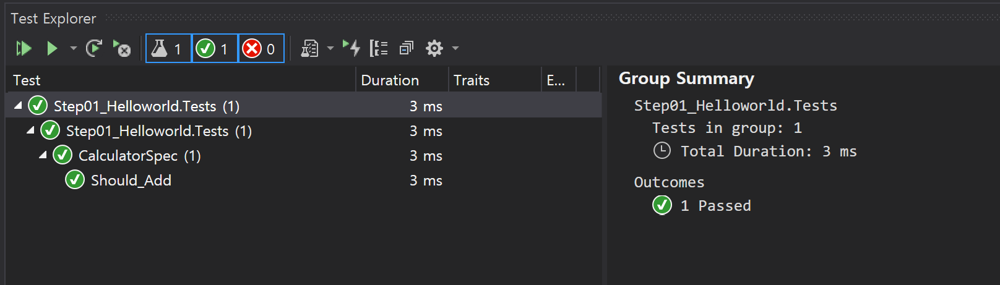

# Chapter 1. Start

## 목차
1. 단위 테스트 프로젝트 만들기 
1. 자연어 형태의 Assert 구현하기 
1. 단위 테스트 실행하기 
1. 코드 커버리지 생성하기
1. GitHub 자동화하기

## Step 1. Helloworld
### 1. 목표
- 단위 테스트 프로젝트를 생성한다.
- 단위 테스트를 생성한다.
- 단위 테스트를 Visual Studio에서 실행한다.

### 2. 단위 테스트 프로젝트 만들기
1. 단위 프로젝트 형식
   - .NET Core Classlibrary C# 프로젝트
1. 단위 테스트 프로젝트명 규칙
   - `프로젝트명.[Tests]`
   - 예. 
     - 프로젝트명 : Step01_Helloworld
     - 단위 테스트 프로젝트명 : `Step01_Helloworld.Tests`
1. 단위 테스트 패키지 추가
   - `xunit`과 `xunit.runner.visualstudio` 버전을 동일 시킨다.
   - xunit 2.4.1
   - xunit.runner.visualstudio 2.4.1
1. 단위 테스트 클래스명 규칙
   - `클래스명Spec`
   - 예
     - 클래스명 : Calculator
     - 단위 테스트 클래스명 :  `CalculatorSpec`
1. 단위 테스트 만들기
   - xUnit가 단위 테스트 클래스와 메서드를 접근하기 위해 `public` 접근 제한자로 지정되어야 한다.
   - `public` 단위 테스트 클래스 
   - `public void` 단위 테스트 메서드 : 결과 값이 없다.
     - `[Fact]` 단위 테스트 속성 추가 : xUnit이 식별하기 위한 속성이다.
   ```cs
   using Xunit;

   public class CalculatorSpec  // 단위 테스트 클래스
   {
          [Fact]
          public void Xyz()     // 단위 테스트 메서드
          {
                // ...
          }
   }
   ```
1. 단위 테스트 구현
   - 3A 패턴 : 단위 테스트는 한번에 하나의 메서드만 테스트한다.
     - Arrange : 메서드 실행 준비
     - Act : 메서드 실행(1개)
     - Assert : 메서드 실행 결과 확인
   ```cs
   public class CalculatorSpec
   {
        [Fact]
        public void Should_Add()
        {
            // Arrange: 준비
            Calculator calc = new Calculator();

            // Act: 수행
            int actual = calc.Add(1, 2);

            // Assert: 확인
            Assert.Equal(3, actual);
        }
   }
   ```
1. 단위 테스트 프로세스 아키텍처 설정
   - 단위 테스트 대상 플랫폼 기준으로 설정한다. : Auto, x86, x64  
   
1. 단위 테스트 실행
   - `Menu > Test > Test Explorer(Ctrl+E,T)`
   

<br/>

## Step 2. Fluent Assertion
### 1. 목표
- Assert 코드를 더 읽기 쉬운 코드(자연어 형태의 코드)로 변경한다. 

### 2. 자연어 형태의 Assert 구현하기
1. 패키지 추가
   - FluentAssertions : 5.10.3
1. Assert 코드 변경
   - FluentAssertions 패키지는 자연어 형태의 코드를 구현을 제공한다.
   - "주어(Subject) should be 명사." 문장은 '주어'와 '명사' Equal 관계를 제공한다.
   - 예.
     - 프로그래밍 언어 : actual.Should().Be(7);
     - 자연어 : The actual should be 7.
   ```cs
   [Fact]
   public void Should_Add()
   {
       // Arrange
       Calculator calc = new Calculator();

       // Act
       int actual = calc.Add(1, 6);

       //=====================
       // Assert 변경 전
       Assert.Equal(7, actual);
       Assert.Equal(actual, 7);
       // Warning xUnit2000
       //   The literal or constant value 7 should be passed as the 'expected' argument in the call 
       //   to 'Assert.Equal(expected, actual)' 
       //   in method 'Should_Add' on type 'CalculatorSpec'.Step02_FluentAssertion.Tests

       //=====================
       // Assert 변경 후
       //=====================
       actual.Should().Be(7);
   }
   ```

<br/>

## Step 3. Run Without Visual Studio
### 1. 목표
- Visual Studio 없이 단위 테스트를 실행한다. 

### 2. 단위 테스트 실행하기 
1. dotnet test 명령어
   - dotnet test 사이트 : [링크](https://docs.microsoft.com/ko-kr/dotnet/core/tools/dotnet-test)
   - 명령어 형식
     ```
     dotnet test [<PROJECT> | <SOLUTION> | <DIRECTORY> | <DLL>]
       [-t|--list-tests]                            // 테스트 목록 확인하기
       [-l|--logger <LOGGER>]                       // -l "console"
       
       // 빌드 구성
       [-c|--configuration <CONFIGURATION>]         // -c release
       [-f|--framework <FRAMEWORK>]                 // TODO .net core 버전?
       [--runtime <RUNTIME_IDENTIFIER>]             // TODO x86/x64?
       
       // 코드 커버리지
       [--collect <DATA_COLLECTOR_NAME>]            // --collect "Code Coverage" 또는 --collect "XPlat Code Coverage"
       [-r|--results-directory <RESULTS_DIR>]       // -r ./TestResults : .sln 파일이 현재 위치다. 단위 테스트별로 개별 폴더를 생성한다(코드 커버리지일 때만 생성된다).

       // xUnit
       [--filter <EXPRESSION>]                      // TODO FullyQualifiedName, DisplayName, Traits

       // 결과물
       [-o|--output <OUTPUT_DIRECTORY>]             // -o ./Output : .sln 파일이 현재 위치다. 단위 테스트별로 개별 폴더를 생성하지 않는다.
                                                    // ./bin/<configuration>/<framework>/ : AppDomain.BaseDirectory
                                                    // 예. ./bin/Debug/netcoreapp3.1
       ...
     ```
1. 단위 테스트 실행
   - 전체 단위 테스트 프로젝트 : `dotnet test`
     - .sln 파일이 있는 폴더에서 실행 시킨다. .sln 파일에 있는 3개의 단위 테스트 프로젝트가 실행된다.
       - Step01_Helloworld.Tests.dll
       - Step02_FluentAssertion.Tests.dll
       - Step03_RunWithoutVS.Tests.dll
   - 특정 단위 테스트 프로젝트 : `dotnet test .\Part01_Fundamentals\Ch01_Start\Step01_Helloworld.Tests\`
   - 로거 : `dotnet test --logger "console;verbosity=detailed"`
   - Release 모드 : `dotnet test -c Release`
   - 예
     ```
     dotnet test .\Part01_Fundamentals\Ch01_Start\Step01_Helloworld.Tests\
     C:\UnitTest\Part01_Fundamentals\Ch01_Start\Step01_Helloworld.Tests\bin\Debug\netcoreapp3.1\Step01_Helloworld.Tests.dll(.NETCoreApp,Version=v3.1)에 대한 테스트 실행
     Microsoft (R) Test Execution Command Line Tool Version 16.7.0
     Copyright (c) Microsoft Corporation. All rights reserved.
     
     테스트 실행을 시작하는 중입니다. 잠시 기다려 주세요...
     
     지정된 패턴과 일치한 총 테스트 파일 수는 1개입니다.
     
     테스트를 실행했습니다.
     총 테스트 수: 1
          통과: 1
      총 시간: 1.1952 초
     ```

<br/>

## Setp 4. Code Coverage
### 1. 목표
- 코드 커버리지를 생성한다.
- 코드 커버리지 결과를 시각화(콘솔, HTML, VS, VSCode)한다.

### 2. 코드 커버리지 생성하기
1. 코드 커버리지 패키지
   - Microsoft.NET.Test.Sdk : --collect "Code Coverage"
   - coverlet
     - VSTest : coverlet.collector, --collect "XPlat Code Coverage"
     - MSBuild : coverlet.msbuild 
1. .netcore test 명령어
1. 코드 커버리지 결과의 폴더 구성
1. 참고 사이트
   - [Use code coverage for unit testing](https://docs.microsoft.com/ko-kr/dotnet/core/testing/unit-testing-code-coverage?tabs=windows)
   - [Coverlet GitHub](https://github.com/coverlet-coverage/coverlet)
   - [Coverlet Integration with MSBuild](https://github.com/coverlet-coverage/coverlet/blob/master/Documentation/MSBuildIntegration.md)
   - [Coverlet integration with VSTest](https://github.com/coverlet-coverage/coverlet/blob/master/Documentation/VSTestIntegration.md)


XUnit.Coverlet.Collector
XUnit.Coverlet.MSBuild

dotnet test --collect:"XPlat Code Coverage"
    // Coverlet의 데이터 수집기에 해당하는 식별 이름입니다. 이 이름은 필수이지만 대/소문자를 구분하지 않습니다.
dotnet test /p:CollectCoverage=true /p:CoverletOutputFormat=cobertura

dotnet tool install -g dotnet-reportgenerator-globaltool
다음 명령을 사용하여 도구를 호출할 수 있습니다. reportgenerator
'dotnet-reportgenerator-globaltool' 도구('4.6.4' 버전)가 설치되었습니다.

dotnet tool list -g
패키지 ID                                 버전              명령
----------------------------------------------------------------------
dotnet-reportgenerator-globaltool      4.6.4           reportgenerator


reportgenerator
"-reports:Path\To\TestProject\TestResults\{guid}\coverage.cobertura.xml"
"-targetdir:coveragereport"
-reporttypes:Html

- [Order .NET Core unit tests](https://github.com/dotnet/samples/tree/master/csharp/unit-testing/XUnit.TestProject)
