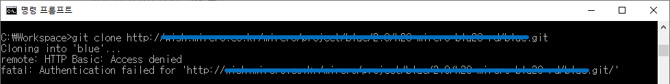
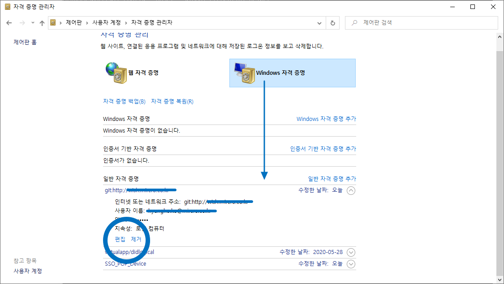

# 환경 설정

## 목차

## 1. Git 계정 설정
- 환경 설정 확인
  ```shell
  git config --list
  ```
- 전역 사용자 설정
  ```shell
  git config --global user.name "awesometic"
  git config --global user.email "awesometic.lab@gmail.com"
  ```
- 로컬 사용자 설정
  - 로컬 사용자 설정은 전역 사용자 설정보다 높은 우선순위를 갖는다.
  ```shell
  git config --local user.name "a-user-only-for-this-repository"
  git config --local user.email "and-an-email-as-well@gmail.com"
  ```
- 관련 자료  
  - [Git 프로젝트/저장소마다 다른 계정 정보 사용하기](https://awesometic.tistory.com/128)
  
## 2. Git 암호 변경  
- 상황
  - 암호가 잘못되어 Clone을 못한다.
    
- Windows에서 Git 암호 변경
  - "실행 > 자격 증명 관리자"을 실행 시킨다(Credential Manager).
  - 해당 암호를 변경한다.
    
- 관련 자료
  - [GIT 암호 변경](https://lazymankook.tistory.com/80)

