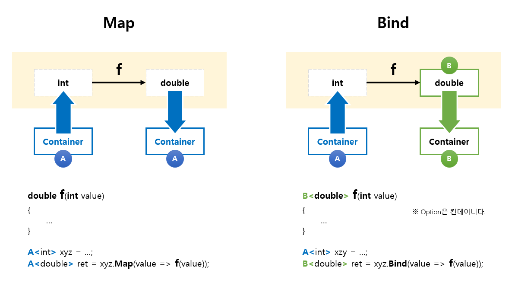

# Learning
- 배움은 설렘이다 for developers.

## 목차
1. 책
   - [함수형 프로그래밍 in C#](./Books/FPinCSharp)
     - [Chapter 02. Why function purity matters](./Books/FPinCSharp/Ch02)
     - [Chapter 03. Designing function signatures and types](./Books/FPinCSharp/Ch03)	
     - [Chapter 05. Designing programs with function composition](./Books/FPinCSharp/Ch05)	
   - [오브젝트](./Books/Object)
     - [Chapter 00. 패러다임](./Books/Object/Ch00)
     - [Chapter 01. 객체, 설계](./Books/Object/Ch01)
   - [C#으로 배우는 적응형 코드](./Books/AdaptiveCode)
     - [Chapter 07. Covariance & Contravariance](./Books/AdaptiveCode/Ch07)
   - [Designing with Types](./Books/DesigningWithTypes)
     - [Chapter 01. Introduction](./Books/DesigningWithTypes/Ch01)
1. 강의
   - [Advanced Defensive Programming Techniques](./Lectures/DefensiveProgramming)
1. 플랫폼
   - [Git](./Platform/Git)
   - [.NET Core](./Platform/NETCore)
1. 패키지
   - [NLog](./Packages/NLog)
     - [로그 정책](./Packages/NLog/Policy)
     - [로그 단위 테스트](./Packages/NLog/UnitTest)
     - [로그 출력 자동화](./Packages/NLog/Tracer)
1. 블로그
   - [Mark Seemann](./Blogs/MarkSeemann)
     - [Refactoring to Aggregate Services](./Blogs/MarkSeemann/RefactoringToAggregateServices)
   - [Others](./Blogs/Others)	
     - [How To Debug LINQ Queries in C#](./Blogs/Others/HowToDebugLINQQueriesInCSharp)
1. Awesome
   - [함수형 프로그래밍](./Awesome/FP)
