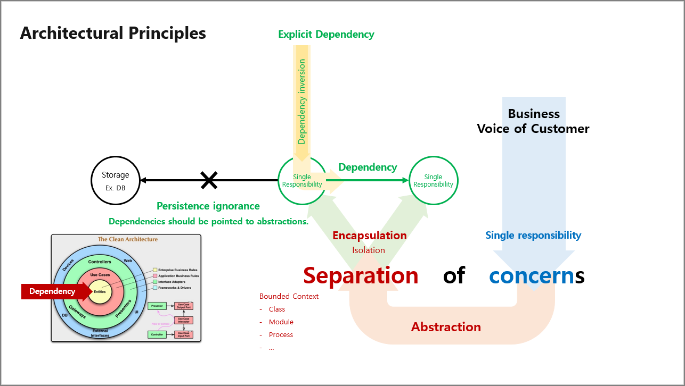

# 배움은 설렘이다 for developers.

## Architectural Principles
> 건축업자가 프로그래머의 프로그램 작성 방식에 따라 건물을 짓는다면 **가장 먼저 도착하는 딱따구리가 문명을 파괴할 것입니다.**  
>
> If builders built buildings the way programmers wrote programs, **then the first woodpecker that came along would destroy civilization.**  
>
> &nbsp; - Gerald Weinberg

- Link : [한국어](https://docs.microsoft.com/ko-kr/dotnet/architecture/modern-web-apps-azure/architectural-principles), [English](https://docs.microsoft.com/en-us/dotnet/architecture/modern-web-apps-azure/architectural-principles)

 

## Contents
1. Tutorials
   - Observability
     - [NLog](./1.Tutorials/Observability/NLog)
     - [Serilog](./1.Tutorials/Observability/Serilog)
   - Clean Architecture
     - Microsoft.Extensions.DependencyInjection  
     - [MediatR](./1.Tutorials/CleanArchitecture/MediatR)
     - FluentValidation
     - Polly
1. Books
   - Domain-Driven Design
     - [도메인 주도 설계 철저 입문](./2.Books/DDD/DDDGuide) 
   - Functional Programming
     - [Functional Programming in C#](./2.Books/FP/FPinCSharp)
   - Microservice
     - [Practical Microservices with Dapr and .NET](./2.Books/Microservice/DaprDotNet)
1. Lectures
   - Domain-Driven Design
     - [Domain-Driven Design in Practice](./3.Lectures/DDD/DddInPractice)
   - Functional Programming
     - [Defensive Programming](./3.Lectures/FP/DefensiveProgramming)
     - [Writing Purely Functional Code In C#](./3.Lectures/FP/WritingPurelyFunctionalCodeInCSharp)
1. Blogs
   - Domain-Driven Design
     - [Designing with Types](./4.Blogs/DDD/DesigningWithTypes_2)
   - Object-Oriented Design
     - [.NET Core Console App with Dependency Injection, Logging, and Settings](./4.Blogs/OOD/BetterConsoleApp/ConsoleUI)
   - Functional Programming
     - [How To Debug LINQ Queries in C#](./4.Blogs/FP/HowToDebugLINQQueriesInCSharp)
   - Refactoring
     - [Refactoring to Aggregate Services](./4.Blogs/Refactoring/RefactoringToAggregateServices)
   - Unit Test
     - [How to Use and Unit Test ILogger](./4.Blogs/UnitTest/HowToUseAndUnitTestILogger)
   - Awesome
     - [Domain-Driven Design](./4.Blogs/Awesome/DDD)
     - [Functional Programming](./4.Blogs/Awesome/FP)

