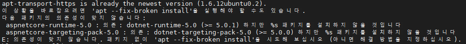

## 목차
1. .NET 5.0 설치
1. .NET 5.0 설치 확인
1. .NET 5.0 제거
1. 명령 Summary
1. 참고 사이트

<br/>

## 1. .NET 5.0 설치
1. `packages-microsoft-prod` 패키지 설치
   ```shell
   # packages-microsoft-prod.deb 파일 다운로드
   wget https://packages.microsoft.com/config/ubuntu/18.04/packages-microsoft-prod.deb -O packages-microsoft-prod.deb
   
   # packages-microsoft-prod 패키지 제거 후 packages-microsoft-prod.deb 패키지 설치
   sudo dpkg --purge packages-microsoft-prod && sudo dpkg -i packages-microsoft-prod.deb
   sudo apt-get update
   ```
1. 신뢰 키 추가
   ```shell
   sudo apt-get install -y gpg
   wget -O - https://packages.microsoft.com/keys/microsoft.asc | gpg --dearmor -o microsoft.asc.gpg
   sudo mv microsoft.asc.gpg /etc/apt/trusted.gpg.d/
   ```
1. 패키지 리포지토리 추가
   ```shell
   wget https://packages.microsoft.com/config/ubuntu/18.04/prod.list
   sudo mv prod.list /etc/apt/sources.list.d/microsoft-prod.list
   sudo chown root:root /etc/apt/trusted.gpg.d/microsoft.asc.gpg
   sudo chown root:root /etc/apt/sources.list.d/microsoft-prod.list
   ```
1. `dotnet-sdk-5.0` 패키지 설치
   ```shell
   sudo apt-get update; \
     sudo apt-get install -y apt-transport-https && \
     sudo apt-get update && \
     sudo apt-get install -y dotnet-sdk-5.0
   ```
   - 오류 : `sudo apt --fix-broken install`을 호출한 후 다시 패키지를 설치한다.
     ```
     apt-transport-https is already the newest version (1.6.12ubuntu0.2).
     이 상황을 바로잡으려면 'apt --fix-broken install'을 실행해야 할 수도 있습니다.
     다음 패키지의 의존성이 맞지 않습니다:
      aspnetcore-runtime-5.0 : 의존: dotnet-runtime-5.0 (>= 5.0.1) 하지만 %s 패키지를 설치하지 않을 것입니다
      aspnetcore-targeting-pack-5.0 : 의존: dotnet-targeting-pack-5.0 (>= 5.0.0) 하지만 %s 패키지를 설치하지 않을 것입니다
     E: 의존성이 맞지 않습니다. 패키지 없이 'apt --fix-broken install'을 시도해 보십시오 (아니면 해결 방법을 지정하십시오).
     ```  
     

<br/>

## 2. .NET 5.0 설치 확인
1. 버전 : `dotnet --version`
   ```
   bluecats@ks-allinone:~$ dotnet --version
   5.0.101
   ```
1. SDKs : `dotnet --list-sdks`
   ```shell
   bluecats@ks-allinone:~$ dotnet --list-sdks
   5.0.101 [/usr/share/dotnet/sdk]
   ```
1. 런타임 : `dotnet --list-runtimes`
   ```shell
   bluecats@ks-allinone:~$ dotnet --list-runtimes
   Microsoft.AspNetCore.App 5.0.1 [/usr/share/dotnet/shared/Microsoft.AspNetCore.App]
   Microsoft.NETCore.App 5.0.1 [/usr/share/dotnet/shared/Microsoft.NETCore.App]
   ```
1. 세부 정보 : `dotnet --info`
   ```shell
   bluecats@ks-allinone:~$ dotnet --info
   .NET SDK(global.json 반영):
    Version:   5.0.101
    Commit:    d05174dc5a
   
   런타임 환경:
    OS Name:     ubuntu
    OS Version:  18.04
    OS Platform: Linux
    RID:         ubuntu.18.04-x64
    Base Path:   /usr/share/dotnet/sdk/5.0.101/
   
   Host (useful for support):
     Version: 5.0.1
     Commit:  b02e13abab
   
   .NET SDKs installed:
     5.0.101 [/usr/share/dotnet/sdk]
   
   .NET runtimes installed:
     Microsoft.AspNetCore.App 5.0.1 [/usr/share/dotnet/shared/Microsoft.AspNetCore.App]
     Microsoft.NETCore.App 5.0.1 [/usr/share/dotnet/shared/Microsoft.NETCore.App]
   
   To install additional .NET runtimes or SDKs:
     https://aka.ms/dotnet-download
   ```
1. 패키지 목록 : `sudo apt list --installed | grep dotnet` 또는 `sudo dpkg -l | grep dotnet`
   ```
   bluecats@ks-allinone:~$ dpkg -l | grep dotnet
   ii  dotnet-apphost-pack-5.0     5.0.1-1       amd64        Microsoft.NETCore.App.Host 5.0.1
   ii  dotnet-host                 5.0.1-1       amd64        Microsoft .NET Host - 5.0.1
   ii  dotnet-hostfxr-5.0          5.0.1-1       amd64        Microsoft .NET Host FX Resolver - 5.0.1 5.0.1
   ii  dotnet-runtime-5.0          5.0.1-1       amd64        Microsoft .NET Runtime - 5.0.1 Microsoft.NETCore.App 5.0.1
   ii  dotnet-runtime-deps-5.0     5.0.1-1       amd64        dotnet-runtime-deps-5.0 5.0.1
   ii  dotnet-sdk-5.0              5.0.101-1     amd64        Microsoft .NET SDK 5.0.101
   ii  dotnet-targeting-pack-5.0   5.0.0-1       amd64        Microsoft.NETCore.App.Ref 5.0.0
   ```

<br/>

## 3. .NET 5.0 제거
1. 패키지 삭제 : `sudo apt purge -y dotnet-*-5.0`, `sudo apt purge -y dotnet-host`
   ```
   sudo apt purge -y dotnet-*-5.0
   sudo apt purge -y dotnet-host
   ```

<br/>

## 4. 명령 Summary
```shell
#
# 설치
#

# packages-microsoft-prod.deb 패키지 설치
wget https://packages.microsoft.com/config/ubuntu/18.04/packages-microsoft-prod.deb -O packages-microsoft-prod.deb
sudo dpkg --purge packages-microsoft-prod && sudo dpkg -i packages-microsoft-prod.deb
sudo apt-get update

# 신뢰 키 추가
sudo apt-get install -y gpg
wget -O - https://packages.microsoft.com/keys/microsoft.asc | gpg --dearmor -o microsoft.asc.gpg
sudo mv microsoft.asc.gpg /etc/apt/trusted.gpg.d/

# Ubuntu 18.04 패키지 리포지토리 추가
wget https://packages.microsoft.com/config/ubuntu/18.04/prod.list
sudo mv prod.list /etc/apt/sources.list.d/microsoft-prod.list
sudo chown root:root /etc/apt/trusted.gpg.d/microsoft.asc.gpg
sudo chown root:root /etc/apt/sources.list.d/microsoft-prod.list

# dotnet-sdk-5.0 패키지 설치
sudo apt-get update; \
  sudo apt-get install -y apt-transport-https && \
  sudo apt-get update && \
  sudo apt-get install -y dotnet-sdk-5.0

# 설치 확인
dotnet --info

# 패키지 확인
dpkg -l | grep dotnet


#
# 제거
#

# 패키지 제거
sudo apt purge -y dotnet-*-5.0
sudo apt purge -y dotnet-host
```

<br/>

### 5. 참고 사이트
- [Ubuntu에 .NET SDK 또는 .NET 런타임 설치](https://docs.microsoft.com/ko-kr/dotnet/core/install/linux-ubuntu#1804-)
- [apt 사용법](http://taewan.kim/tip/apt-apt-get/)
