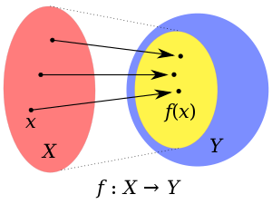
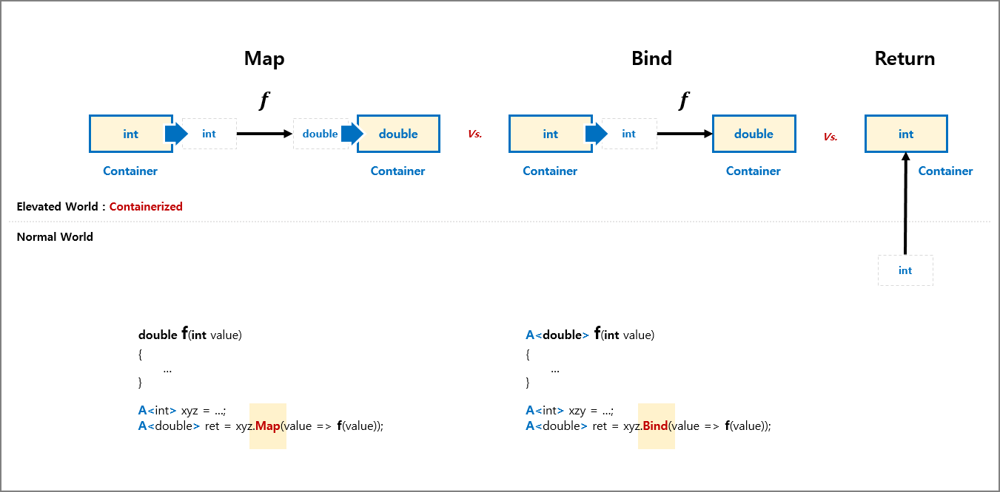

# 함수형

## 1. 함수
1. Expression vs. Statement
   - Expression 
     - [An expression in a programming language is **a syntactic entity** that **may be evaluated** to determine its value.](https://en.wikipedia.org/wiki/Expression_(computer_science))
     - **결과 값이 있다.**
     - 예. if 구문에 결과 값이 있다(then과 else는 expression만 허용한다).
       ```
       // F# IF 구문 
       // if boolean-expression then expression1 [ else expression2 ]
       //
      
       let test x y =
         if x = y then "equals"
         elif x < y then "is less than"
         else "is greater than"
      
       printfn "%d %s %d." 10 (test 10 20) 20
       ```
   - Statement
     - [a statement **only containing executable code** and a definition instantiating an identifier, while an expression evaluates to a value only.](https://en.wikipedia.org/wiki/Statement_(computer_science))
     - **결과 값이 없다.**
     - 예. if 구문에 결과 값이 없다(명시적으로 return 구문을 추가해야한다).
       ```
       // C# IF 구문
       // if (boolean-expression)
       // {
       //     statement;
       // }
       // else
       // {
       //     statement;
       // }
       //
      
       string Test(int x, int y)
       {
           if (x == y) return "equals";
           else if (x < y) return "is less than";
           else return "is greater than";
       }
       
       WriteLine($"10 {Test(10, 20)} 20");
       ```
   - Expression과 Statement 관계
     - [A statement may have internal components (e.g., expressions).](https://en.wikipedia.org/wiki/Statement_(computer_science))  
     
   - 왜 Expression이 중요한가?
     - 수학 함수 정의 : [첫 번째 집합의 임의의 한 원소를 두 번째 집합의 오직 한 원소에 대응시키는 이항관계다. ](https://ko.wikipedia.org/wiki/%ED%95%A8%EC%88%98)  
	   
	 - 수학 함수 f는 입력 x와 출력 y을 갖는다.
	 - Expression을 통해 프로그램 세계의 함수도 입력(argument type)과 출력(return type)을 갖는다(Statement은 출력이 선택적이다).
	 - Expression을 통해 프로그램 세계의 함수가 수학 함수 성질 중 "입력과 출력" 존재를 충족 시킨다.
1. Expression과 Declarative, Composition, Readable 관계
   ```
   Expression : Founction Name → Declarative ─────────────┐
      │                                                   ↘
     input/output : Function Signature → Pure → Predictable → Testable → Maintainable 
      ↓                                                   ↗
   Composition : Function Flow → Readable ────────────────┘  
   ```
1. Map vs. Bind vs. Return : Normal World vs Elevated World(Containerized)
   

## 2. 자료구조
1. 불변 vs. 가변