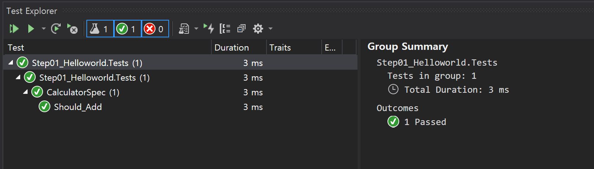
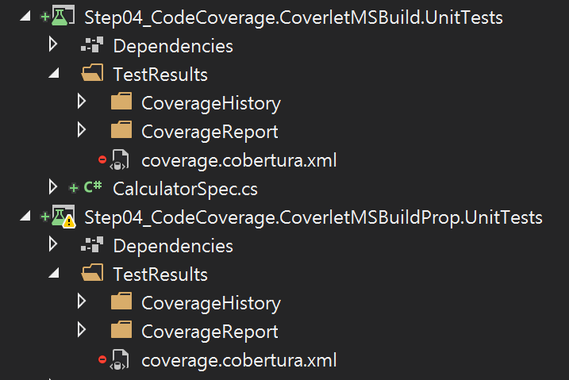

# Chapter 2. Getting Started

## 목차
1. 단위 테스트 프로젝트 만들기 : Step01_Helloworld
1. 자연어 형태의 Assert 구현하기 : Step02_FluentAssertion
1. 단위 테스트 실행하기 : Step03_RunWithoutVS
1. 코드 커버리지 생성하기 : Step04_CodeCoverage
1. 복수 프로젝트 코드 커버리지 통합하기 : Step05_MultipleCodeCoverage
1. GitHub 자동화하기

<br/>

## **1. 단위 테스트 프로젝트 만들기 : Step01_Helloworld**
### 1. 목표
- 단위 테스트 프로젝트를 생성한다.
- 단위 테스트를 생성한다.
- 단위 테스트를 Visual Studio에서 실행한다.

### 2. 단위 테스트 프로젝트 만들기
1. 단위 프로젝트 형식
   - .NET Core Classlibrary C# 프로젝트
1. 단위 테스트 프로젝트명 규칙
   - `프로젝트명.[Tests]`
   - 예. 
     - 프로젝트명 : Step01_Helloworld
     - 단위 테스트 프로젝트명 : `Step01_Helloworld.Tests`
1. 단위 테스트 패키지 추가
   - `xunit`과 `xunit.runner.visualstudio` 버전을 동일 시킨다.
   - xunit 2.4.1
   - xunit.runner.visualstudio 2.4.1
1. 단위 테스트 클래스명 규칙
   - `클래스명Spec`
   - 예
     - 클래스명 : Calculator
     - 단위 테스트 클래스명 :  `CalculatorSpec`
1. 단위 테스트 만들기
   - xUnit가 단위 테스트 클래스와 메서드를 접근하기 위해 `public` 접근 제한자로 지정되어야 한다.
   - `public` 단위 테스트 클래스 
   - `public void` 단위 테스트 메서드 : 결과 값이 없다.
     - `[Fact]` 단위 테스트 속성 추가 : xUnit이 식별하기 위한 속성이다.
   ```cs
   using Xunit;

   public class CalculatorSpec  // 단위 테스트 클래스
   {
          [Fact]
          public void Xyz()     // 단위 테스트 메서드
          {
                // ...
          }
   }
   ```
1. 단위 테스트 구현
   - 3A 패턴 : 단위 테스트는 한번에 하나의 메서드만 테스트한다.
     - Arrange : 메서드 실행 준비
     - Act : 메서드 실행(1개)
     - Assert : 메서드 실행 결과 확인
   ```cs
   public class CalculatorSpec
   {
        [Fact]
        public void Should_Add()
        {
            // Arrange: 준비
            Calculator calc = new Calculator();

            // Act: 수행
            int actual = calc.Add(1, 2);

            // Assert: 확인
            Assert.Equal(3, actual);
        }
   }
   ```
1. 단위 테스트 프로세스 아키텍처 설정
   - 단위 테스트 대상 플랫폼 기준으로 설정한다. : Auto, x86, x64  
   
1. 단위 테스트 실행
   - `Menu > Test > Test Explorer(Ctrl+E,T)`
   

<br/>

## **2. 자연어 형태의 Assert 구현하기 : Step02_FluentAssertion**
### 1. 목표
- Assert 코드를 더 읽기 쉬운 코드(자연어 형태의 코드)로 변경한다. 

### 2. 자연어 형태의 Assert 구현하기
1. 패키지 추가
   - FluentAssertions : 5.10.3
1. Assert 코드 변경
   - FluentAssertions 패키지는 자연어 형태의 코드를 구현을 제공한다.
   - "주어(Subject) should be 명사." 문장은 '주어'와 '명사' Equal 관계를 제공한다.
   - 예.
     - 프로그래밍 언어 : actual.Should().Be(7);
     - 자연어 : The actual should be 7.
   ```cs
   [Fact]
   public void Should_Add()
   {
       // Arrange
       Calculator calc = new Calculator();

       // Act
       int actual = calc.Add(1, 6);

       //=====================
       // Assert 변경 전
       Assert.Equal(7, actual);
       Assert.Equal(actual, 7);
       // Warning xUnit2000
       //   The literal or constant value 7 should be passed as the 'expected' argument in the call 
       //   to 'Assert.Equal(expected, actual)' 
       //   in method 'Should_Add' on type 'CalculatorSpec'.Step02_FluentAssertion.Tests

       //=====================
       // Assert 변경 후
       //=====================
       actual.Should().Be(7);
   }
   ```
1. 더 직관적인 실패 메시지
   - 변경 전 : ``
   - 변경 후 : ``

<br/>

## **3. 단위 테스트 실행하기 : Step03_RunWithoutVS**
### 1. 목표
- Visual Studio 없이 단위 테스트를 실행한다. 

### 2. 단위 테스트 실행하기 
1. dotnet test 명령어
   - 명령어 형식
     ```
     dotnet test [<PROJECT> | <SOLUTION> | <DIRECTORY> | <DLL>]
       [-t|--list-tests]                            // 테스트 목록 확인하기(테스트는 실행하지 않는다)
       [-l|--logger <LOGGER>]                       // -l "console"
       
       // 빌드 구성
       [-c|--configuration <CONFIGURATION>]         // -c release
       [-f|--framework <FRAMEWORK>]                 // TODO .net core 버전?
       [--runtime <RUNTIME_IDENTIFIER>]             // TODO x86/x64?
       
       // 코드 커버리지
       [--collect <DATA_COLLECTOR_NAME>]            // --collect "Code Coverage" 또는 --collect "XPlat Code Coverage"
       [-r|--results-directory <RESULTS_DIR>]       // -r ./TestResults : .sln 파일이 현재 위치다. 단위 테스트별로 개별 폴더를 생성한다(코드 커버리지일 때만 생성된다).

       // xUnit
       [--filter <EXPRESSION>]                      // TODO FullyQualifiedName, DisplayName, Traits

       // 결과물
       [-o|--output <OUTPUT_DIRECTORY>]             // -o ./Output : .sln 파일이 현재 위치다. 단위 테스트별로 개별 폴더를 생성하지 않는다.
                                                    // ./bin/<configuration>/<framework>/ : AppDomain.BaseDirectory
                                                    // 예. ./bin/Debug/netcoreapp3.1
       ...
     ```
1. 단위 테스트 실행
   - 전체 단위 테스트 프로젝트 : `dotnet test`
     - .sln 파일이 있는 폴더에서 실행 시킨다. .sln 파일에 있는 3개의 단위 테스트 프로젝트가 실행된다.
       - Step01_Helloworld.Tests.dll
       - Step02_FluentAssertion.Tests.dll
       - Step03_RunWithoutVS.Tests.dll
   - 특정 단위 테스트 프로젝트 : `dotnet test .\Part01_Fundamentals\Ch01_Start\Step01_Helloworld.Tests\`
   - 로거 : `dotnet test --logger "console;verbosity=detailed"`
   - Release 모드 : `dotnet test -c Release`
   - 예
     ```
     dotnet test .\Part01_Fundamentals\Ch01_Start\Step01_Helloworld.Tests\
     C:\...\Step01_Helloworld.Tests\bin\Debug\netcoreapp3.1\Step01_Helloworld.Tests.dll(.NETCoreApp,Version=v3.1)에 대한 테스트 실행
     Microsoft (R) Test Execution Command Line Tool Version 16.7.0
     Copyright (c) Microsoft Corporation. All rights reserved.
     
     테스트 실행을 시작하는 중입니다. 잠시 기다려 주세요...
     
     지정된 패턴과 일치한 총 테스트 파일 수는 1개입니다.
     
     테스트를 실행했습니다.
     총 테스트 수: 1
          통과: 1
      총 시간: 1.1952 초
     ```

<br/>

## **4. 코드 커버리지 생성하기 : Step04_CodeCoverage**
### 1. 목표
- 코드 커버리지를 생성한다.
- 코드 커버리지 결과를 시각화(콘솔, HTML, VS, VSCode)한다.

### 2. 코드 커버리지 만들기
1. 요약
   - **명령어로** 코드 커버리지 & HTML 결과 만들기
     - `dotnet test /p:CollectCoverage=true /p:CoverletOutputFormat=cobertura /p:CoverletOutput=./TestResults/`
     - `reportgenerator "-reports:./TestResults/coverage.cobertura.xml" "-targetdir:./TestResults/CoverageReport" -reporttypes:Html -historydir:./TestResults/CoverageHistory`
   - **프로젝트 속성으로** 코드 커버리지 & HTML 결과 만들기
     - 프로젝트 속성
     - `dotnet test /t:coverage`
1. Coverlet 
   - MSBuild : 
     - 패키지 : coverlet.msbuild 
     - 문서 : [Coverlet Integration with MSBuild](https://github.com/coverlet-coverage/coverlet/blob/master/Documentation/MSBuildIntegration.md)
     - 명령어 : .proj 파일이 있는 곳에 coverage.json 파일을 생성한다.
       ```
       dotnet test 
          /p:CollectCoverage=true 
          /p:CoverletOutputFormat=cobertura   // 출력 형식
          /p:CoverletOutput=./TestResults/     // 출력 경로 : 반드시 `/`을 추가해야한다.
          /p:Include="[CompanyName.*]*" 
          /p:Exclude="[*Tests]*"
       ```
       - 출력 형식
         - Json(기본형식) : coverage.json
         - lcov : coverage.info
         - Cobertura : coverage.cobertura.xml
         - OpenCover : coverage.opencover.xml
     - 프로젝트 속성
       ```
       <PropertyGroup>
          <TargetFramework>netcoreapp3.1</TargetFramework>
          <CollectCoverage>true</CollectCoverage>
          <CoverletOutputFormat>cobertura</CoverletOutputFormat>
          <CoverletOutput>./TestResult/</CoverletOutput>
       </PropertyGroup>
       ```
   - [ ] TODO VSTest
     - 패키지 : coverlet.collector
     - 문서 : [Coverlet integration with VSTest](https://github.com/coverlet-coverage/coverlet/blob/master/Documentation/VSTestIntegration.md)
     - 명령어
       - 'XPlat Code Coverage'은 데이터 수집기에 해당하는 식별 이름입니다. 이 이름은 필수이지만 대/소문자를 구분하지 않습니다.
       ```
       dotnet test 
          --collect:"XPlat Code Coverage"
          // TODO --출력형식
          // TODO --출력경로
          // TODO --포함
          // TODO --제외
       ```
   - [ ] TODO coverlet.console
     - 설치 : `dotnet tool install --global coverlet.console`  
     - 설치 확인 : `dotnet tool list -g`
     - 명령어
       ```
       coverlet 
          /path/to/test-assembly.dll      // 단위 테스트 프로젝트 DLL
          --target "dotnet"               // 고정값
          --targetargs "test /path/to/test-project --no-build"    // dotnet 명령어
          // TODO --출력형식
          // TODO --출력경로
          // TODO --포함
          // TODO --제외
       ```
1. [ ] TODO Microsoft.NET.Test.Sdk
   - dotnet test 명령어
     ```
     dotnet test 
          --collect "Code Coverage"
          // TODO --출력형식
          // TODO --출력경로
          // TODO --포함
          // TODO --제외
     ```

### 3. 코드 커버리지 HTML 만들기
1. dotnet-reportgenerator-globaltool
   - dotnet-reportgenerator-globaltool 도구 설치
     - `dotnet tool install -g dotnet-reportgenerator-globaltool`
   - Global 도구 설치 목록 확인하기
     ```
     dotnet tool list -g
     패키지 ID                                 버전              명령
     ----------------------------------------------------------------------
     dotnet-reportgenerator-globaltool      4.6.4           reportgenerator
     ```
   - 옵션
     ```
     -reports:<report>[;<report>][;<report>]["]         // 코드 커버리지 파일
     -targetdir:<target directory>["]                   // 출력 경로
     -reporttypes:<Html|HtmlSummary|...>[;<Html|HtmlSummary|...>]["]]   // 출력 형식
     -historydir:<history directory>["]]                // 코드 커버리지 이력 경로
     -verbosity:<Verbose|Info|Warning|Error|Off>["]]    // 로그 수준
     -assemblyfilters:<(+|-)filter>[;<(+|-)filter>][;<(+|-)filter>]["]]
     -classfilters:<(+|-)filter>[;<(+|-)filter>][;<(+|-)filter>]["]]
     -filefilters:<(+|-)filter>[;<(+|-)filter>][;<(+|-)filter>]["]]
     -sourcedirs:<directory>[;<directory>][;<directory>]["]]
     -plugins:<plugin>[;<plugin>][;<plugin>]["]]
     -title:<title>["]]
     -tag:<tag>["]]
     ```
   - 명령어
     ```
     reportgenerator 
        "-reports:./TestResults/coverage.cobertura.xml"     // 코드 커버리지 파일
        "-targetdir:./TestResults/CoverageReport"           // 출력 경로
        -reporttypes:Html                                   // 출력 형식
        -historydir:./TestResults/CoverageHistory
     ```
1. ReportGenerator 
   - 패키지 : ReportGenerator
   - 옵션
     ```
     ReportFiles          // 코드 커버리지 파일
     TargetDirectory      // 출력 경로
     ReportTypes          // 출력 형식
     HistoryDirectory     // 코드 커버리지 이력 경로
     VerbosityLevel       // 로그 수준
     AssemblyFilters="+Include;-Excluded"
     ClassFilters
     FileFilters
     ...
     ```
   - 예 : 프로젝트 .proj 파일
     ```
     <Target Name="Coverage">
       <ItemGroup>
         <CoverageFiles Include="./TestResults/coverage.cobertura.xml" />
       </ItemGroup>
       <ReportGenerator ReportFiles="@(CoverageFiles)" TargetDirectory="./TestResults/CoverageReport" ReportTypes="Html" HistoryDirectory="./TestResults/CoverageHistory" VerbosityLevel="Info" />
     </Target>
     ```
   - 명령어
     - dotnet test /t:coverage
     - dotnet build /t:coverage
     - dotnet msbuild /t:coverage
1. 솔루션 탐색기 구성  
     


### 4. 코드 커버리지 제외
1. ```ExcludeFromCodeCoverage``` 애트리뷰트
   - 제외 대상 클래스, 생성자, 메서드는 ExcludeFromCodeCoverage 애트리뷰트를 지정한다.
1. 메서드 제외하기
   ```cs
   using System.Diagnostics.CodeAnalysis;

   [ExcludeFromCodeCoverage]
   public void DoSomething()
   { 
       ...
   }
   ```
1. 클래스 제외하기
   ```cs
   using System.Diagnostics.CodeAnalysis;

   [ExcludeFromCodeCoverage]
   public class Foo
   {
       ...
   }
   ```

### 5. Visual Studio 코드 커버리지
1. AxoCover([Site](https://marketplace.visualstudio.com/items?itemName=axodox1.AxoCover), [GitHub](https://github.com/axodox/AxoCover))
   - xUnit 2.2.0만 제공한다.
   - Visual Studio 2019는 현재 제공하지 않는다(2020-04-07 기준)
     - [Warning on Open with VS2019 Plugin](https://github.com/axodox/AxoCover/issues/204)
     - [AxoCover for VS2019](https://github.com/axodox/AxoCover/issues/197)
1. PrestoCoverage([Site](https://marketplace.visualstudio.com/items?itemName=PiotrKula.prestocoverage), [GitHub](https://github.com/ppumkin/PrestoCoverage))
   - Visual Studio 2017, 2019 모두 제공한다.
   - Coverlet 기반으로 동작한다.

<br/>

## **4. 복수 프로젝트 코드 커버리지 통합하기 : Step05_MultipleCodeCoverage**
### 1. 목표
- 복수개 단위 테스트 결과를 1개로 통합 시킨다.


<br/>

## 참고 사이트
- [dotnet test](https://docs.microsoft.com/ko-kr/dotnet/core/tools/dotnet-test)
- [Use code coverage for unit testing](https://docs.microsoft.com/ko-kr/dotnet/core/testing/unit-testing-code-coverage?tabs=windows)
- [Coverlet GitHub](https://github.com/coverlet-coverage/coverlet)
- [Coverlet Integration with MSBuild](https://github.com/coverlet-coverage/coverlet/blob/master/Documentation/MSBuildIntegration.md)
- [Coverlet integration with VSTest](https://github.com/coverlet-coverage/coverlet/blob/master/Documentation/VSTestIntegration.md)
- [Order .NET Core unit tests](https://github.com/dotnet/samples/tree/master/csharp/unit-testing/XUnit.TestProject)
- [Make dotnet test work on solution files](https://dasmulli.blog/2018/01/20/make-dotnet-test-work-on-solution-files/)
- [ReportGenerator](https://github.com/danielpalme/ReportGenerator)
